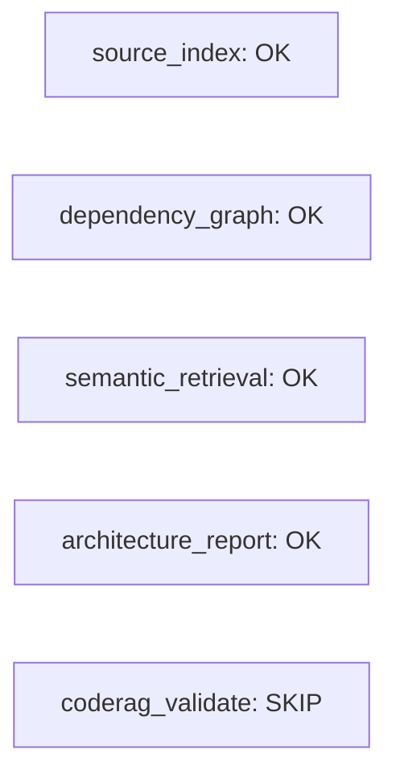
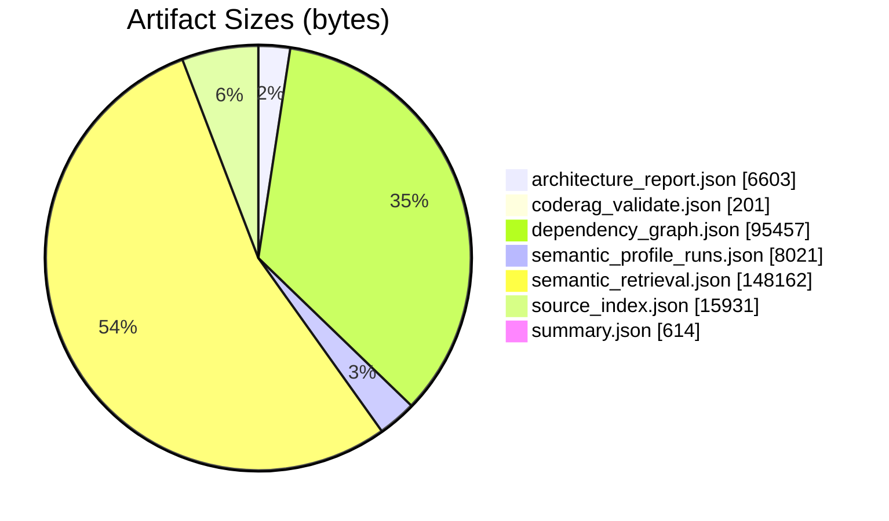
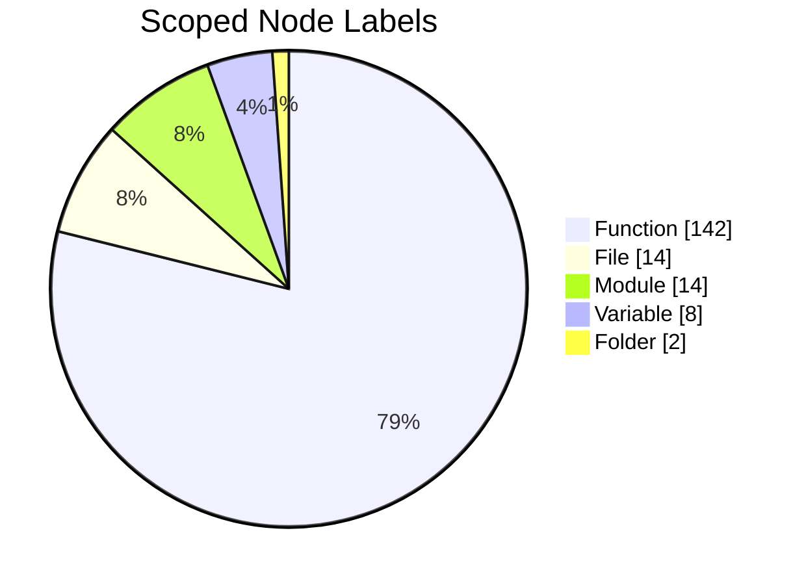
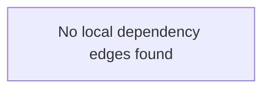
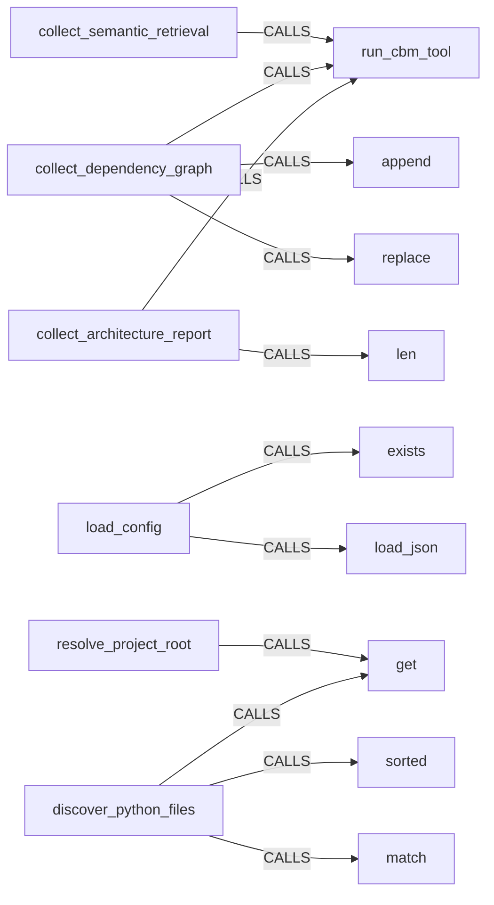
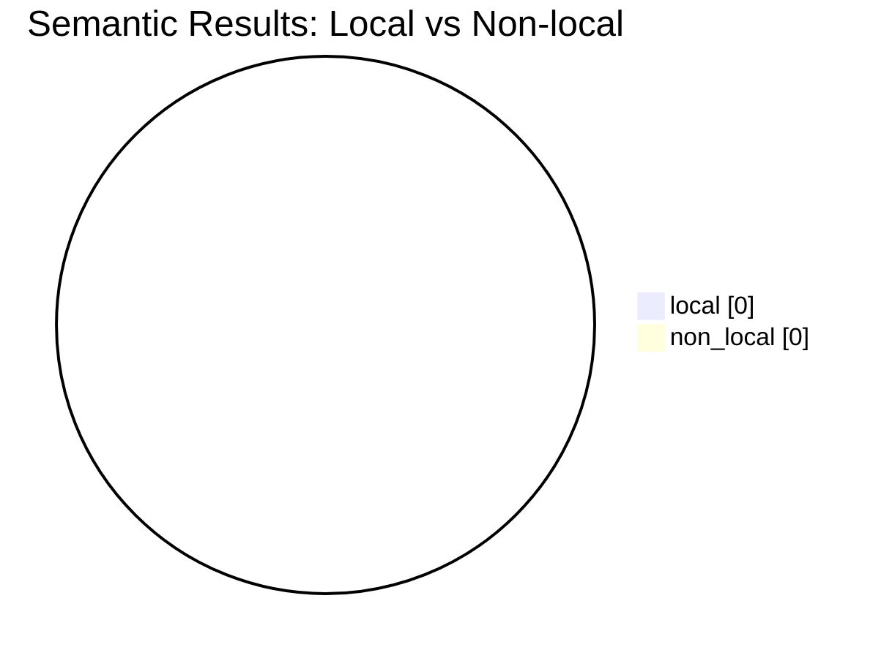

# Candidate Analysis Report

Generated: 2026-09-16T06:19:49

Project: `refactor_cli`

This report converts the raw Phase A candidate artifacts into a human-readable summary so the merit of the output can be checked quickly.

## Status

| Module | Status |
|---|---|
| source_index | OK |
| dependency_graph | OK |
| semantic_retrieval | OK |
| architecture_report | OK |
| coderag_validate | SKIP |

Example:
- Rerun the pipeline with `refactor-cli candidate-phase-a --config .refactor/config.json`.
- Then render the report with `refactor-cli candidate-report --config .refactor/config.json`.
- If a module is FAIL, start with the failed artifact rather than the report itself.

## Artifact Sizes

| Artifact | Bytes |
|---|---:|
| architecture_report.json | 6603 |
| coderag_validate.json | 201 |
| dependency_graph.json | 95457 |
| semantic_profile_runs.json | 8021 |
| semantic_retrieval.json | 148162 |
| source_index.json | 15931 |
| summary.json | 614 |

Example:
- Larger JSON files usually mean broader graph output or more search hits.
- Open the matching artifact in `.refactor/analysis/candidates/` when you need raw rows or payload fields.
- Compare `semantic_retrieval.json` against `dependency_graph.json` to see ranking vs. raw edges.

## What The Raw Files Mean

- `source_index.json`: index health and coverage
- `dependency_graph.json`: raw edge extraction
- `semantic_retrieval.json`: ranked and grouped search hits
- `architecture_report.json`: highest-value human summary
- `summary.json`: pass/fail snapshot

Examples:
- If `semantic_retrieval.json` looks noisy, run `refactor-cli candidate-search --label Class` and tighten the query.
- If `source_index.json` is wrong, check `.refactor/config.json` and rerun Phase A.
- If you only need the architecture summary, open `architecture_report.json` first.

## Evaluation Matrix

| Artifact | Candidate | Input Used | Output Produced | How To Interpret |
|---|---|---|---|---|
| source_index.json | codebase-memory-mcp | Config-scoped staging repo from .refactor/config.json, files=src/refactor_cli/__init__.py, src/refactor_cli/__main__.py, src/refactor_cli/analysis/architecture_report.py, src/refactor_cli/analysis/candidate_tools.py, src/refactor_cli/analysis/dependency_graph.py | Indexed graph metadata: node/edge counts, exclusions, parse warnings, project registration | Tells us whether downstream graph outputs are trustworthy enough to inspect and whether indexing stayed inside the configured file set |
| dependency_graph.json | codebase-memory-mcp | MATCH (s)-[r:CALLS|IMPORTS|INHERITS]->(t) WHERE coalesce(s.qn, s.name) STARTS WITH 'refactor_cli.src.refactor_cli' AND NOT coalesce(s.qn, s.name) CONTAINS '.eval.' AND NOT coalesce(t.qn, t.name) CONTAINS '.eval.' RETURN coalesce(s.qn, s.name) AS source, type(r) AS relation, coalesce(t.qn, t.name) AS target | Raw CALLS/IMPORTS/INHERITS edge rows capped at max_rows | Useful as machine graph data, but broad queries can mix target code with indexed evaluation repos |
| semantic_retrieval.json | codebase-memory-mcp | semantic terms=['dependency', 'module', 'architecture', 'transformation', 'quality metrics'], scope hint=src/refactor_cli | Grouped structural matches plus semantic ranking rows with scores | Good for discoverability, but current broad corpus makes semantic ranking noisy |
| architecture_report.json | codebase-memory-mcp | get_architecture(aspects=overview) on full corpus and scoped path re-query | Human-readable counts, hotspots, clusters, node labels, edge types | Most useful artifact for quickly understanding structure and central coordination points |

Observation:
- This makes the pipeline traceable. Each artifact can now be judged by the exact input it used, the candidate that produced it, and the meaning of the output.

Example:
- To inspect a specific artifact, run the matching wrapper command instead of opening the JSON first.
- For discovery questions, `candidate-search` is the shortest path.
- For a full structural refresh, use `candidate-phase-a` and then `candidate-report`.

## Readiness Checklist

| Capability | Status |
|---|---|
| Indexing and project registration | OK |
| Scoped architecture extraction | OK |
| Scoped dependency extraction | OK |
| Scoped semantic retrieval signal | OK |
| CodeRAG validation | SKIP |
| Persistent daemon mode | OUT_OF_SCOPE |

Policy note:
- Persistent daemon mode is intentionally not part of this project's operating model.
- Current scope policy: file scope `src/refactor_cli`, qn scope `refactor_cli.src.refactor_cli`, excluded qn substrings `['.eval.']`.

Examples:
- `LOW_SIGNAL` means the semantic query should be narrowed or rewritten.
- `PARTIAL` on dependency extraction usually means the QN scope needs adjustment.
- `OUT_OF_SCOPE` on daemon mode means you can ignore that item for this project.

## Index Health

- Indexed nodes: 45506
- Indexed edges: 196730
- Excluded directories shown by the tool: .ruff_cache, .git, docs, .pytest_cache, .refactor/patches
- Partial parse count: 60
- Not indexed file count: 60

Observation:
- The index succeeded and is large enough for meaningful graph analysis.
- The corpus may include auxiliary folders beyond `src/refactor_cli`, so raw full-project results are noisier than the scoped package.

Example:
- If this section shows extra noise, try `refactor-cli candidate-search --scope-path src/refactor_cli --label Class`.
- Add `--cbm-options "--include-connected"` when you want CBM to show connected context around the matches.
- Use `--cbm-options "--min-degree 1"` to suppress weaker graph noise.

## Full-Corpus Architecture Snapshot

- Languages detected in the indexed corpus: Python=14
- This confirms that the full graph is dominated by the evaluation repositories, not just the target package.

Example:
- This snapshot is useful when you want a quick sanity check on scope contamination.
- If full-corpus results look too broad, switch to a scoped query with `--scope-path src/refactor_cli`.
- For a tighter class view, add `--label Class`.

## Scoped Architecture For `src/refactor_cli`

- Scoped total nodes: 180
- Scoped total edges: 463
- Entry point: refactor_cli.src.refactor_cli.main src/refactor_cli/__init__.py

Top scoped edge types:
- CALLS=199, DEFINES=164, IMPORTS=48, USAGE=20, CONTAINS_FILE=14, SIMILAR_TO=8

Hotspots:
- refactor_cli.src.refactor_cli.analysis.candidate_tools.run_cbm_tool 12
- refactor_cli.src.refactor_cli.discovery.resolve_project_root 7
- refactor_cli.src.refactor_cli.discovery.load_config 7
- refactor_cli.src.refactor_cli.file_io.write_json 5
- refactor_cli.src.refactor_cli._resolve_candidate_search_settings 5
- refactor_cli.src.refactor_cli.file_io.load_json 4
- refactor_cli.src.refactor_cli.candidate_report._scope_filter 4
- refactor_cli.src.refactor_cli._config_or_default 4

Clusters:
- 8 src 40 0.7797 build_candidate_report;_configured_semantic_profiles_summary;_scoped_semantic_search;_extract_text_content;_architecture_text src CALLS
- 1 src 23 0.68 load_config;cmd_apply_tree_patch;cmd_apply_tree_edit;resolve_project_root;run_source_index src CALLS
- 4 src 17 0.7429 _resolve_candidate_search_settings;_resolve_candidate_phase_a_settings;_resolve_candidate_report_settings;_load_optional_config;_config_or_default src CALLS
- 7 src 17 0.68 run_tree_transition;post_apply_safeguards;apply_extract_top_level_symbols_emend;build_after_tree_from_edit;build_symbol_index src CALLS
- 0 src 16 0.6452 run_cbm_tool;cmd_candidate_phase_a;_scope_filter;_scoped_dependency_edges;_scoped_module_dependency_edges src CALLS
- 2 src 16 0.7391 generate_tree_payload;apply_extract_top_level_symbols;write_tree_yaml;build_updated_source;ensure_parent src CALLS

Entry points:
- refactor_cli.src.refactor_cli.main src/refactor_cli/__init__.py

Observation:
- The real package is a compact Python CLI package.
- The central coordination points are discovery/config/file-writing helpers and the candidate integration runner.

Example:
- Use `refactor-cli candidate-search --scope-path src/refactor_cli --label Function` to inspect the implementation entrypoints behind this section.
- If you need more context around a result, add `--cbm-options "--include-connected"`.

## Scoped Module Dependencies

- Data source: local AST import fallback
- Unique module import edges: 0

Highest fan-out modules:
- No module import edges recovered.

Highest fan-in modules:
- No inbound module import edges recovered.

Observation:
- Module-level imports show how the package is stitched together structurally.
- This is the most stable dependency view when function-call extraction is sparse or noisy.

Example:
- Query module relationships directly with `refactor-cli candidate-search --scope-path src/refactor_cli --label Function --cbm-options "--relationship IMPORTS"`.
- Add `--cbm-options "--include-connected"` to include attached context.

## Scoped Function Dependencies

The current stored `dependency_graph.json` is raw and broad. For clarity, this report derives a scoped function-call view from direct CBM graph queries and falls back to local structure only when necessary.

Highest fan-out functions:
- refactor_cli.src.refactor_cli.discovery.generate_tree_payload (6)
- refactor_cli.src.refactor_cli.discovery.discover_python_files (4)
- refactor_cli.src.refactor_cli.analysis.dependency_graph.collect_dependency_graph (3)
- refactor_cli.src.refactor_cli.tree_codec.write_tree_yaml (3)
- refactor_cli.src.refactor_cli.analysis.architecture_report.collect_architecture_report (2)
- refactor_cli.src.refactor_cli.discovery.load_config (2)

Highest fan-in targets:
- builtins.dict.get (5)
- builtins.list.append (4)
- refactor_cli.src.refactor_cli.analysis.candidate_tools.run_cbm_tool (3)
- builtins.len (2)
- refactor_cli.eval.candidates.InvAASTCluster.ITSP-dataset.Lab-7.3079.295540_correct.replace (1)
- refactor_cli.eval.candidates.InvAASTCluster.ITSP-dataset.Lab-10.3237.Main.exists (1)

Coherent local edge examples:
- refactor_cli.src.refactor_cli.analysis.semantic_retrieval.collect_semantic_retrieval CALLS refactor_cli.src.refactor_cli.analysis.candidate_tools.run_cbm_tool
- refactor_cli.src.refactor_cli.analysis.dependency_graph.collect_dependency_graph CALLS builtins.list.append
- refactor_cli.src.refactor_cli.analysis.dependency_graph.collect_dependency_graph CALLS refactor_cli.src.refactor_cli.analysis.candidate_tools.run_cbm_tool
- refactor_cli.src.refactor_cli.analysis.architecture_report.collect_architecture_report CALLS builtins.len
- refactor_cli.src.refactor_cli.analysis.architecture_report.collect_architecture_report CALLS refactor_cli.src.refactor_cli.analysis.candidate_tools.run_cbm_tool
- refactor_cli.src.refactor_cli.discovery.load_config CALLS refactor_cli.src.refactor_cli.file_io.load_json

Suspicious edge examples:
- refactor_cli.src.refactor_cli.analysis.dependency_graph.collect_dependency_graph CALLS refactor_cli.eval.candidates.InvAASTCluster.ITSP-dataset.Lab-7.3079.295540_correct.replace
- refactor_cli.src.refactor_cli.discovery.load_config CALLS refactor_cli.eval.candidates.InvAASTCluster.ITSP-dataset.Lab-10.3237.Main.exists
- refactor_cli.src.refactor_cli.discovery.discover_python_files CALLS refactor_cli.eval.candidates.InvAASTCluster.ITSP-dataset.Lab-11.3299.Main.sorted
- refactor_cli.src.refactor_cli.discovery.discover_python_files CALLS refactor_cli.eval.candidates.codebase-memory-mcp.src.cypher.cypher.match
- refactor_cli.src.refactor_cli.tree_codec._compact_to_node CALLS refactor_cli.eval.candidates.InvAASTCluster.ITSP-dataset.Lab-11.3299.305681_correct.partition
- refactor_cli.src.refactor_cli.tree_codec._compact_to_node CALLS refactor_cli.eval.candidates.codebase-memory-mcp.internal.cbm.lsp.scope.CBMScopeChunk.next

Observation:
- The graph can recover useful function-level coordination points when the qualified-name scope is set correctly.
- Function-call edges are good for hotspot inspection, but module imports remain the more stable architectural signal.
- Suspicious cross-corpus edges should still be treated as a scoping or indexing problem, not as trustworthy architecture data.

Example:
- Use `refactor-cli candidate-search --scope-path src/refactor_cli --label Function --cbm-options "--relationship CALLS"` to focus on call flow.
- If the query is too broad, add `--cbm-options "--min-degree 1"`.

## Scoped Class / Model Surface

This section uses the class and method nodes exposed by codebase-memory. In Python repositories this is usually the closest available proxy for model-level structure.

- Class-to-method edges recovered: 0
- Inheritance edges recovered: 0

Classes with the largest method surfaces:
- No class/method surface recovered from the scoped graph.

Inheritance examples:
- No class inheritance edges recovered.

Observation:
- This section is only as rich as the repository's class usage. Function-heavy scripts will naturally produce a sparse model view.
- For dataclass-heavy or OO-heavy projects, this becomes the best high-level view of model boundaries and behavior ownership.

Example:
- Use `refactor-cli candidate-search --scope-path src/refactor_cli --label Class` to inspect the same model surface interactively.
- Add `--cbm-options "--include-connected"` if you want the surrounding function context for a class hit.

## Semantic Retrieval Interpretation

The stored artifact is evaluated as-is, without generating extra example queries unless explicitly requested.

What the output looks like:
- `groups`: files with local matches, each row showing `name`, `label`, `lines`, `in`, `out`
- `semantic.rows`: ranked hits with `qn`, `label`, `file`, and `score`
- In other words, this is ranked graph search output, not a generated answer.

Examples:
- For the configured profile queries, run `refactor-cli candidate-search --profile "Calculation and processing"`.
- For a one-off question, pass `--semantic-query '["simulation","run_model","throughput","servicegrad","kanban"]'`.
- For more context around a hit, add `--cbm-options "--include-connected"`.

How semantic is it?
- The search uses semantic terms, but the answer is still grounded in the indexed graph.
- In this repo, that means the signal is partially semantic and partially structural.
- The score is most useful as a prioritization hint after you already know the package scope.

Configured semantic query intents:

- No configured semantic query profiles.

Configured query findings:
- No profile findings available.

Evaluation scorecard for the baseline scoped search:
- local grouped files: 8
- local grouped rows: 30
- local ranking rows: 0
- non-local ranking rows: 0

- Local grouped hits in `src/refactor_cli`:
- src/refactor_cli/__init__.py: `DEFAULT_APPLIED_PATCHES_DIR` (Variable, in=1, out=0)
- src/refactor_cli/__init__.py: `DEFAULT_CANDIDATE_OUTPUT_DIR` (Variable, in=3, out=0)
- src/refactor_cli/__init__.py: `DEFAULT_CANDIDATE_REPORT` (Variable, in=1, out=0)
- src/refactor_cli/__init__.py: `DEFAULT_CONFIG` (Variable, in=2, out=0)
- src/refactor_cli/__init__.py: `DEFAULT_TREE` (Variable, in=1, out=0)
- src/refactor_cli/__init__.py: `DEFAULT_TREE_EDIT` (Variable, in=1, out=0)
- src/refactor_cli/__init__.py: `DEFAULT_TREE_PATCH` (Variable, in=1, out=0)
- src/refactor_cli/__init__.py: `__file__` (File, in=0, out=0)
- src/refactor_cli/__main__.py: `__file__` (File, in=0, out=0)
- src/refactor_cli/__init__.py: `_candidate_analysis_config` (Function, in=3, out=1)

- Semantic rows split:
    - local scoped rows: 0
    - non-local rows: 0

Observation:
- The semantic retrieval command works, but the ranking still drifts into .eval candidates in this corpus.
- The grouped local results are the useful part for understanding this project.

What this means in practice:
- Successful execution does not imply meaningful insight.
- For this project, semantic retrieval is best used as package-local discovery plus a raw ranking hint, not as a reliable answer engine.

How to use it here:
- Search with file_pattern=src/refactor_cli/* when you need package-local discovery.
- Treat semantic rows as corpus-wide ranking hints, not as a scoped file filter.
- Use grouped hits to find local files, then inspect the file-level summary and the ranking scores together.
- If the local ratio stays at 0, the query terms are too broad for the package or the corpus is too noisy.

More detail options:
- Use `refactor-cli candidate-search` for ad hoc questions without rebuilding the full report.
- Add `--cbm-options` when you want raw CBM flags such as `--include-connected` or `--relationship CALLS`.
- Use `--scope-path src/refactor_cli` when you want a narrower package-local query than the report default.
- Use `--label Class` to inspect model/data surfaces and `--label Function` to inspect flow and orchestration.
- If the report says LOW_SIGNAL, narrow the terms or add CBM graph constraints such as `--min-degree 1`.

## Practical Conclusions

- The outputs have merit, but only after scoping and summarization.
- `architecture_report.json` plus the scoped module/function/class sections above are the strongest combination for human understanding.
- `dependency_graph.json` and `semantic_retrieval.json` should still be treated as machine-oriented raw data unless filtered to the target package.
- Demo-style semantic examples are best kept opt-in, because they evaluate tooling behavior rather than describing the target architecture.
- The report should focus on engineering insight first: entrypoints, hotspots, module imports, function coordination points, and class/model surface.

## Optional Provider Note

- CodeRAG status: `SKIP`. Reason: Missing required Neo4j environment variables.
