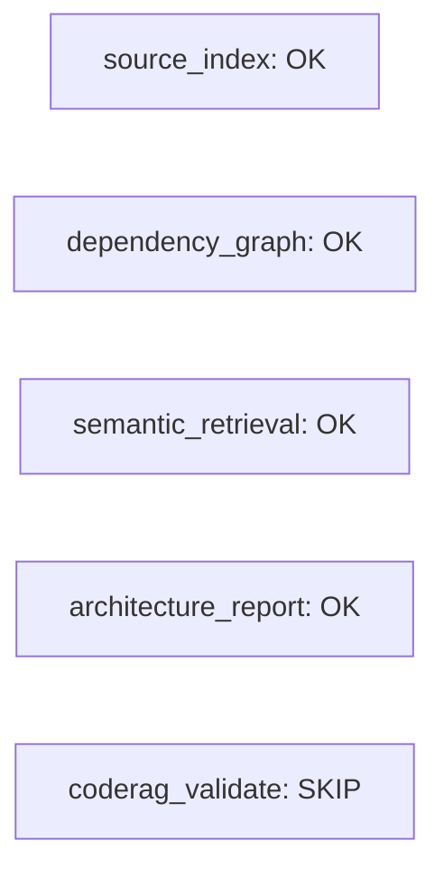
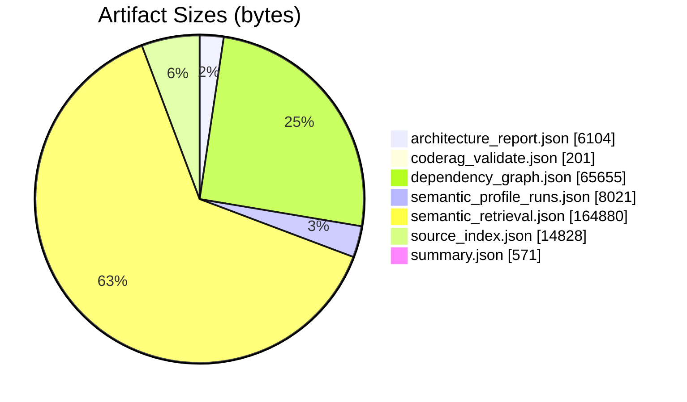
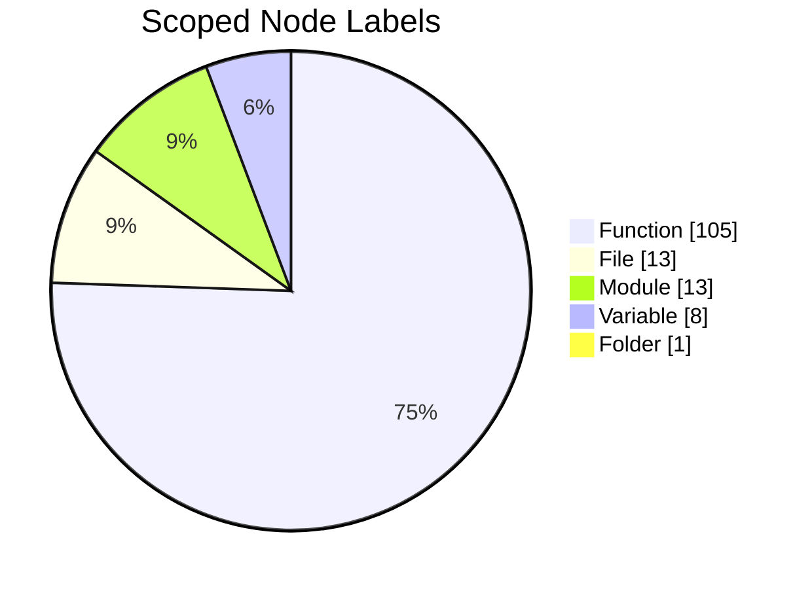
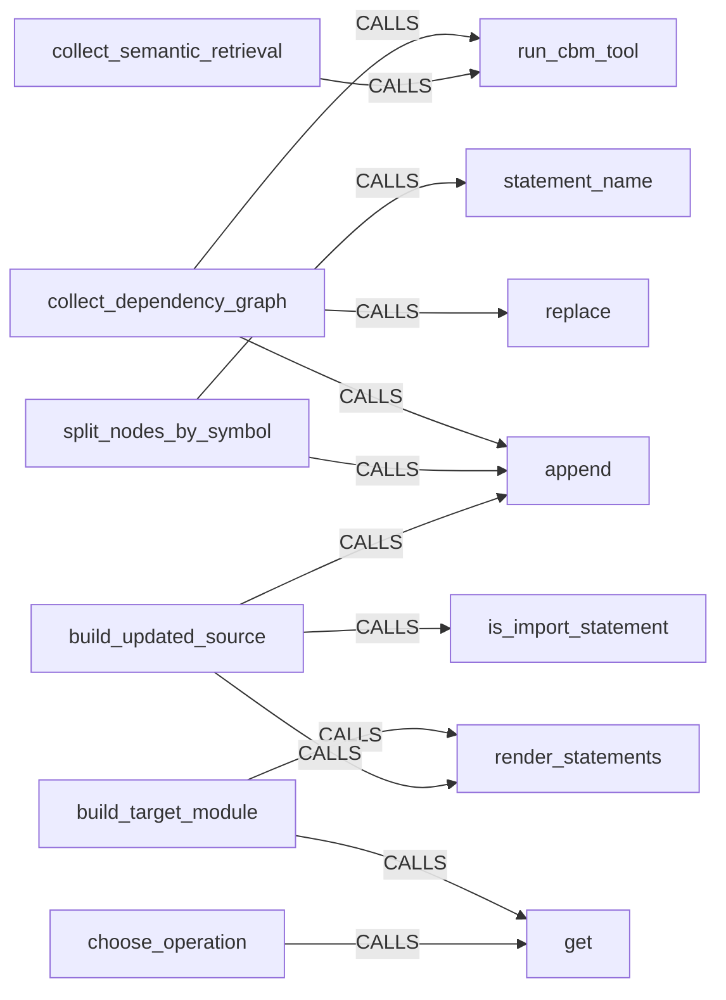
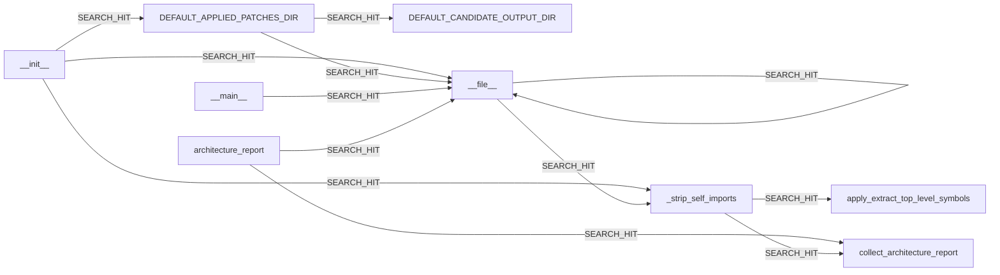
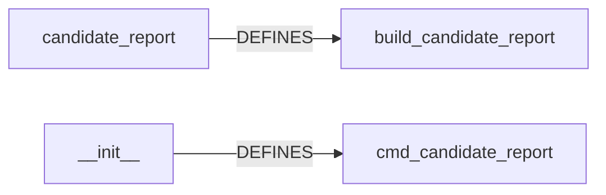
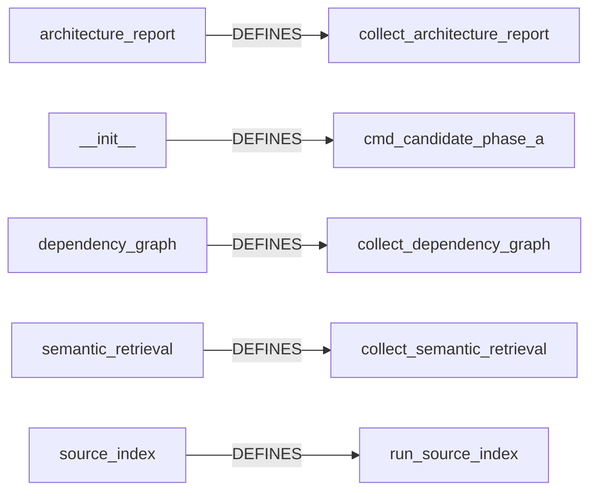
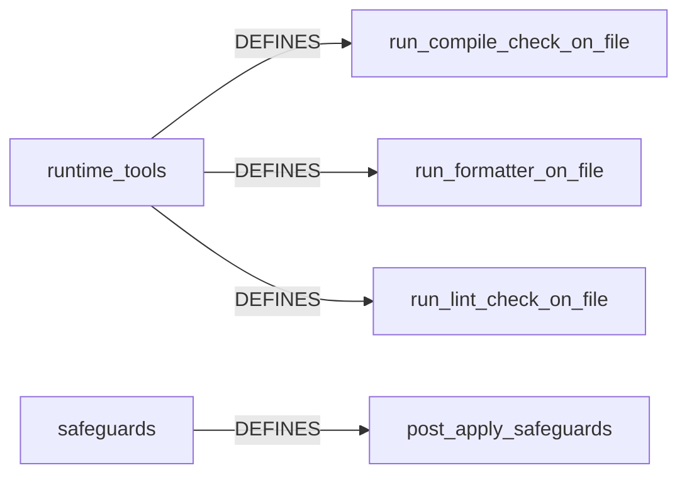
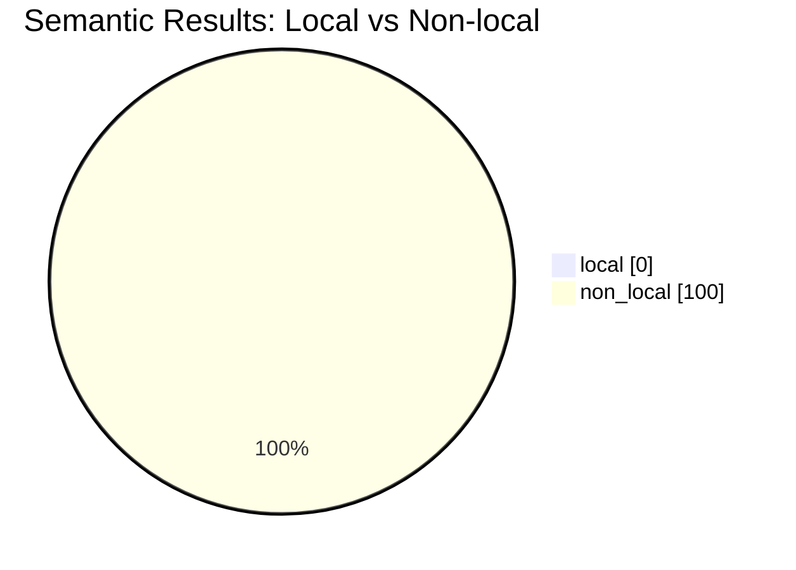

# Candidate Analysis Report

Generated: 2026-08-13T13:37:52

Project: `refactor_cli`

This report converts the raw Phase A candidate artifacts into a human-readable summary so the merit of the output can be checked quickly.

## Status

| Module | Status |
|---|---|
| source_index | OK |
| dependency_graph | OK |
| semantic_retrieval | OK |
| architecture_report | OK |
| coderag_validate | SKIP |

## Artifact Sizes

| Artifact | Bytes |
|---|---:|
| architecture_report.json | 6104 |
| coderag_validate.json | 201 |
| dependency_graph.json | 65655 |
| semantic_profile_runs.json | 8021 |
| semantic_retrieval.json | 164880 |
| source_index.json | 14828 |
| summary.json | 571 |

## What The Raw Files Mean

- `source_index.json`: index health and coverage
- `dependency_graph.json`: raw edge extraction
- `semantic_retrieval.json`: ranked and grouped search hits
- `architecture_report.json`: highest-value human summary
- `summary.json`: pass/fail snapshot

## Evaluation Matrix

| Artifact | Candidate | Input Used | Output Produced | How To Interpret |
|---|---|---|---|---|
| source_index.json | codebase-memory-mcp | Config-scoped staging repo from .refactor/config.json, files=src/refactor_cli/__init__.py, src/refactor_cli/__main__.py, src/refactor_cli/architecture_report.py, src/refactor_cli/candidate_report.py, src/refactor_cli/candidate_tools.py | Indexed graph metadata: node/edge counts, exclusions, parse warnings, project registration | Tells us whether downstream graph outputs are trustworthy enough to inspect and whether indexing stayed inside the configured file set |
| dependency_graph.json | codebase-memory-mcp | MATCH (s)-[r:CALLS|IMPORTS|INHERITS]->(t) WHERE coalesce(s.qn, s.name) STARTS WITH 'refactor_cli.src.refactor_cli' AND NOT coalesce(s.qn, s.name) CONTAINS '.eval.' AND NOT coalesce(t.qn, t.name) CONTAINS '.eval.' AND NOT coalesce(s.qn, s.name) CONTAINS '.eval.' AND NOT coalesce(t.qn, t.name) CONTAINS '.eval.' RETURN coalesce(s.qn, s.name) AS source, type(r) AS relation, coalesce(t.qn, t.name) AS target | Raw CALLS/IMPORTS/INHERITS edge rows capped at max_rows | Useful as machine graph data, but broad queries can mix target code with indexed evaluation repos |
| semantic_retrieval.json | codebase-memory-mcp | semantic terms=['dependency', 'refactor', 'module', 'call graph'], scope hint=src/refactor_cli | Grouped structural matches plus semantic ranking rows with scores | Good for discoverability, but current broad corpus makes semantic ranking noisy |
| architecture_report.json | codebase-memory-mcp | get_architecture(aspects=overview) on full corpus and scoped path re-query | Human-readable counts, hotspots, clusters, node labels, edge types | Most useful artifact for quickly understanding structure and central coordination points |

Observation:
- This makes the pipeline traceable. Each artifact can now be judged by the exact input it used, the candidate that produced it, and the meaning of the output.

## Readiness Checklist

| Capability | Status |
|---|---|
| Indexing and project registration | OK |
| Scoped architecture extraction | OK |
| Scoped dependency extraction | OK |
| Scoped semantic retrieval signal | OK |
| CodeRAG validation | SKIP |
| Persistent daemon mode | OUT_OF_SCOPE |

Policy note:
- Persistent daemon mode is intentionally not part of this project's operating model.
- Current scope policy: file scope `src/refactor_cli`, qn scope `refactor_cli.src.refactor_cli`, excluded qn substrings `['.eval.', '.eval.']`.

## Index Health

- Indexed nodes: 45464
- Indexed edges: 196395
- Excluded directories shown by the tool: .ruff_cache, .git, docs, .pytest_cache, .refactor/patches
- Partial parse count: 60
- Not indexed file count: 62

Observation:
- The index succeeded and is large enough for meaningful graph analysis.
- The corpus includes `.eval/candidates`, so raw full-project results are noisier than the actual `src/refactor_cli` package.

## Full-Corpus Architecture Snapshot

- Languages detected in the indexed corpus: Python=13
- This confirms that the full graph is dominated by the evaluation repositories, not just the target package.

## Scoped Architecture For `src/refactor_cli`

- Scoped total nodes: 140
- Scoped total edges: 341
- Entry point: refactor_cli.src.refactor_cli.main src/refactor_cli/__init__.py

Top scoped edge types:
- CALLS=134, DEFINES=126, IMPORTS=42, USAGE=17, CONTAINS_FILE=13, WRITES=8

Hotspots:
- refactor_cli.src.refactor_cli.candidate_tools.run_cbm_tool 8
- refactor_cli.src.refactor_cli.discovery.resolve_project_root 6
- refactor_cli.src.refactor_cli.discovery.load_config 6
- refactor_cli.src.refactor_cli.file_io.write_json 5
- refactor_cli.src.refactor_cli.discovery.discover_python_files 4
- refactor_cli.src.refactor_cli.runtime_tools.ensure_runtime_dependencies 3
- refactor_cli.src.refactor_cli.file_io.load_json 3
- refactor_cli.src.refactor_cli.file_io.ensure_parent 3

Clusters:
- 7 src 31 0.85 build_candidate_report;_mermaid_scoped_edges;_extract_text_content;_architecture_text;_status_label src CALLS
- 4 src 17 0.68 run_tree_transition;post_apply_safeguards;apply_extract_top_level_symbols_emend;build_after_tree_from_edit;build_symbol_index src CALLS
- 0 src 13 0.6667 run_cbm_tool;cmd_candidate_phase_a;collect_dependency_graph;collect_semantic_retrieval;_scoped_architecture src CALLS
- 2 src 11 0.5517 load_config;generate_tree_payload;run_source_index;resolve_project_root;cmd_format src CALLS
- 3 src 11 0.6087 cmd_apply_tree_patch;cmd_apply_tree_edit;ensure_runtime_dependencies;load_tree_yaml;resolve_emend_runner src CALLS
- 1 src 9 0.75 apply_extract_top_level_symbols;build_updated_source;split_nodes_by_symbol;build_target_module;load_module src CALLS

Observation:
- The real package is a compact Python CLI package.
- The central coordination points are discovery/config/file-writing helpers and the candidate integration runner.

## Scoped Dependency View

The current stored `dependency_graph.json` is raw and broad. For clarity, this report derives a scoped dependency sample for `src/refactor_cli` from the actual local Python imports when the graph query is empty.

Coherent local edge examples:
- refactor_cli.src.refactor_cli.dependency_graph.collect_dependency_graph CALLS builtins.list.append
- refactor_cli.src.refactor_cli.dependency_graph.collect_dependency_graph CALLS refactor_cli.src.refactor_cli.candidate_tools.run_cbm_tool
- refactor_cli.src.refactor_cli.semantic_retrieval.collect_semantic_retrieval CALLS refactor_cli.src.refactor_cli.candidate_tools.run_cbm_tool
- refactor_cli.src.refactor_cli.split_nodes_by_symbol CALLS refactor_cli.src.refactor_cli.discovery.statement_name
- refactor_cli.src.refactor_cli.split_nodes_by_symbol CALLS builtins.list.append
- refactor_cli.src.refactor_cli.build_target_module CALLS builtins.dict.get

Suspicious edge examples:
- refactor_cli.src.refactor_cli.dependency_graph.collect_dependency_graph CALLS refactor_cli.eval.candidates.InvAASTCluster.ITSP-dataset.Lab-7.3079.295540_correct.replace
- refactor_cli.src.refactor_cli.choose_operation CALLS refactor_cli.eval.candidates.InvAASTCluster.ITSP-dataset.Lab-11.3299.Main.sorted
- refactor_cli.src.refactor_cli.choose_operation CALLS refactor_cli.eval.candidates.InvAASTCluster.ITSP-dataset.Lab-10.3237.Main.exists
- refactor_cli.src.refactor_cli.choose_operation CALLS refactor_cli.eval.candidates.InvAASTCluster.ITSP-dataset.Lab-12.3361.307667_buggy.stream_of_characters.len
- refactor_cli.src.refactor_cli.choose_operation CALLS refactor_cli.eval.candidates.codebase-memory-mcp.internal.cbm.lsp.scope.CBMScopeChunk.next
- refactor_cli.src.refactor_cli.apply_unified_diff_to_text CALLS refactor_cli.eval.candidates.InvAASTCluster.ITSP-dataset.Lab-12.3361.307667_buggy.stream_of_characters.len

Observation:
- The graph does recover real local structure, for example file-writing and candidate runner relationships.
- When the indexed graph is empty, the report falls back to a local AST import graph so the dependency section still shows the package structure.
- It also produces suspicious cross-corpus edges into `.eval` repositories, which means raw dependency output should not be trusted without scoping or filtering.

## Search-hit Dependency View

This diagram shows the local results captured by semantic search within `src/refactor_cli` so the report can reflect the actual discovery hits as well as the raw import graph.

## Semantic Retrieval Interpretation

The stored artifact is evaluated as-is, but the local grouped examples below come from three live re-queries built from repo-specific questions.

What the output looks like:
- `groups`: files with local matches, each row showing `name`, `label`, `lines`, `in`, `out`
- `semantic.rows`: ranked hits with `qn`, `label`, `file`, and `score`
- In other words, this is ranked graph search output, not a generated answer.

How semantic is it?
- The search uses semantic terms, but the answer is still grounded in the indexed graph.
- In this repo, that means the signal is partially semantic and partially structural.
- The score is most useful as a prioritization hint after you already know the package scope.

Representative searches and findings:

### Example 1: Where is the candidate analysis report assembled?
- Why this question: should surface report-building code and the report output path
- Search sent: semantic_query=[candidate report markdown mermaid render], file_pattern=src/refactor_cli/*, limit=30
- Raw counts: groups=7, group_rows=30, semantic_rows=30, local=0, non_local=30
- Top grouped hit: src/refactor_cli/__init__.py -> DEFAULT_APPLIED_PATCHES_DIR (Variable, group_rows=7)
- Top semantic hit: refactor_cli.eval.candidates.InvAASTCluster.ITSP-dataset.Lab-10.3241.303561_correct.stringcmp [Function] in .eval/candidates/InvAASTCluster/ITSP-dataset/Lab-10/3241/303561_correct.c score=0.1012
- Dependency diagram from discovered items:

- Verification search sent: name_pattern=build_candidate_report|cmd_candidate_report|candidate_report, label=Function, limit=20
- Verification counts: groups=2, rows=2
- Verification top hit: src/refactor_cli/candidate_report.py -> build_candidate_report (Function, group_rows=1)
- Human-readable result: the semantic rank is still noisy, but the verification search confirms the local function(s) that implement the question.

### Example 2: Where does Phase A collect and persist artifacts?
- Why this question: should surface the orchestration function that runs the analysis pipeline
- Search sent: semantic_query=[candidate phase a source index semantic retrieval architecture report], file_pattern=src/refactor_cli/*, limit=30
- Raw counts: groups=7, group_rows=30, semantic_rows=30, local=0, non_local=30
- Top grouped hit: src/refactor_cli/__init__.py -> DEFAULT_APPLIED_PATCHES_DIR (Variable, group_rows=7)
- Top semantic hit: refactor_cli.eval.candidates.InvAASTCluster.correct_submissions.C-Pack-IPAs.lab02.ex08.ex08-stu_020-sub_016.main [Function] in .eval/candidates/InvAASTCluster/correct_submissions/C-Pack-IPAs/lab02/ex08/ex08-stu_020-sub_016.c score=0.1163
- Dependency diagram from discovered items:

- Verification search sent: name_pattern=cmd_candidate_phase_a|run_source_index|collect_dependency_graph|collect_semantic_retrieval|collect_architecture_report, label=Function, limit=20
- Verification counts: groups=5, rows=5
- Verification top hit: src/refactor_cli/architecture_report.py -> collect_architecture_report (Function, group_rows=1)
- Human-readable result: the semantic rank is still noisy, but the verification search confirms the local function(s) that implement the question.

### Example 3: Where are the safety checks around edit application?
- Why this question: should surface the post-edit guardrail path and formatting checks
- Search sent: semantic_query=[compile check format safeguards tree edit], file_pattern=src/refactor_cli/*, limit=30
- Raw counts: groups=7, group_rows=30, semantic_rows=30, local=0, non_local=30
- Top grouped hit: src/refactor_cli/__init__.py -> DEFAULT_APPLIED_PATCHES_DIR (Variable, group_rows=7)
- Top semantic hit: refactor_cli.eval.candidates.InvAASTCluster.incorrect_submissions.itsp.lab4.ex2830.271605.main [Function] in .eval/candidates/InvAASTCluster/incorrect_submissions/itsp/lab4/ex2830/271605.c score=0.0627
- Dependency diagram from discovered items:

- Verification search sent: name_pattern=post_apply_safeguards|run_compile_check_on_file|run_formatter_on_file|run_lint_check_on_file, label=Function, limit=20
- Verification counts: groups=2, rows=4
- Verification top hit: src/refactor_cli/runtime_tools.py -> run_compile_check_on_file (Function, group_rows=3)
- Human-readable result: the semantic rank is still noisy, but the verification search confirms the local function(s) that implement the question.

Evaluation scorecard for the baseline scoped search:
- local grouped files: 7
- local grouped rows: 30
- local ranking rows: 0
- non-local ranking rows: 100

- Local grouped hits in `src/refactor_cli`:
- src/refactor_cli/__init__.py: `DEFAULT_APPLIED_PATCHES_DIR` (Variable, in=1, out=0)
- src/refactor_cli/__init__.py: `DEFAULT_CANDIDATE_OUTPUT_DIR` (Variable, in=2, out=0)
- src/refactor_cli/__init__.py: `DEFAULT_CANDIDATE_REPORT` (Variable, in=1, out=0)
- src/refactor_cli/__init__.py: `DEFAULT_CONFIG` (Variable, in=1, out=0)
- src/refactor_cli/__init__.py: `DEFAULT_TREE` (Variable, in=1, out=0)
- src/refactor_cli/__init__.py: `DEFAULT_TREE_EDIT` (Variable, in=1, out=0)
- src/refactor_cli/__init__.py: `DEFAULT_TREE_PATCH` (Variable, in=1, out=0)
- src/refactor_cli/__init__.py: `__file__` (File, in=0, out=3)
- src/refactor_cli/__main__.py: `__file__` (File, in=0, out=0)
- src/refactor_cli/candidate_report.py: `_architecture_text` (Function, in=1, out=1)

- Semantic rows split:
    - local scoped rows: 0
    - non-local rows: 100

Observation:
- The semantic retrieval command works, but the ranking still drifts into .eval candidates in this corpus.
- The grouped local results are the useful part for understanding this project.

What this means in practice:
- Successful execution does not imply meaningful insight.
- For this project, semantic retrieval is best used as package-local discovery plus a raw ranking hint, not as a reliable answer engine.

How to use it here:
- Search with file_pattern=src/refactor_cli/* when you need package-local discovery.
- Treat semantic rows as corpus-wide ranking hints, not as a scoped file filter.
- Use grouped hits to find local files, then inspect the file-level summary and the ranking scores together.
- If the local ratio stays at 0, the query terms are too broad for the package or the corpus is too noisy.

## Practical Conclusions

- The outputs have merit, but only after scoping and summarization.
- `architecture_report.json` is the strongest artifact for human understanding.
- `dependency_graph.json` and `semantic_retrieval.json` should be treated as machine-oriented raw data unless filtered to the target package.
- The next improvement should be default scoped output for `candidate-phase-a` so the generated artifacts are human-usable by default.
- The report should be used to decide which candidate behaviors are actually production-worthy, not just technically runnable.

## Optional Provider Note

- CodeRAG status: `SKIP`. Reason: Missing required Neo4j environment variables.
