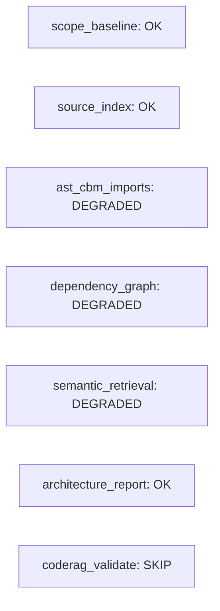
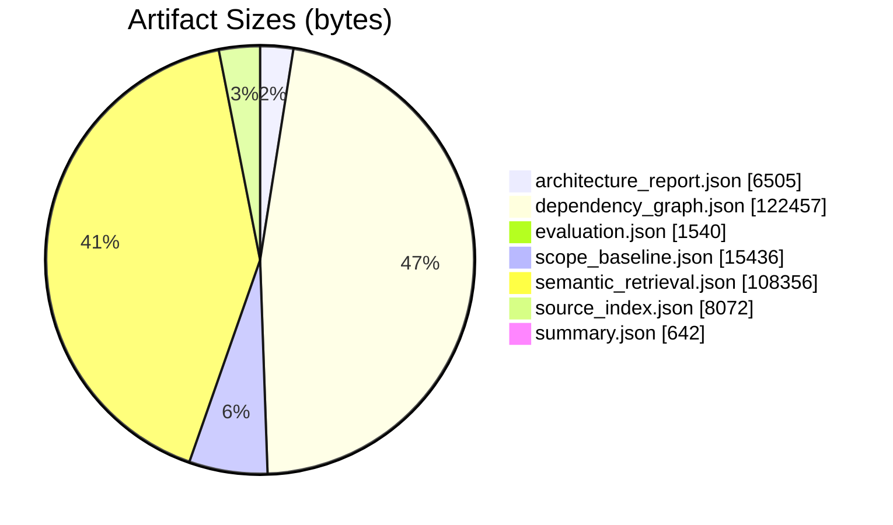
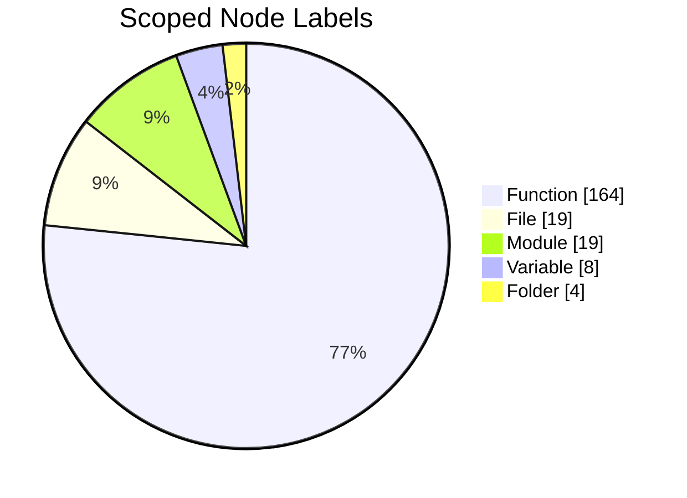
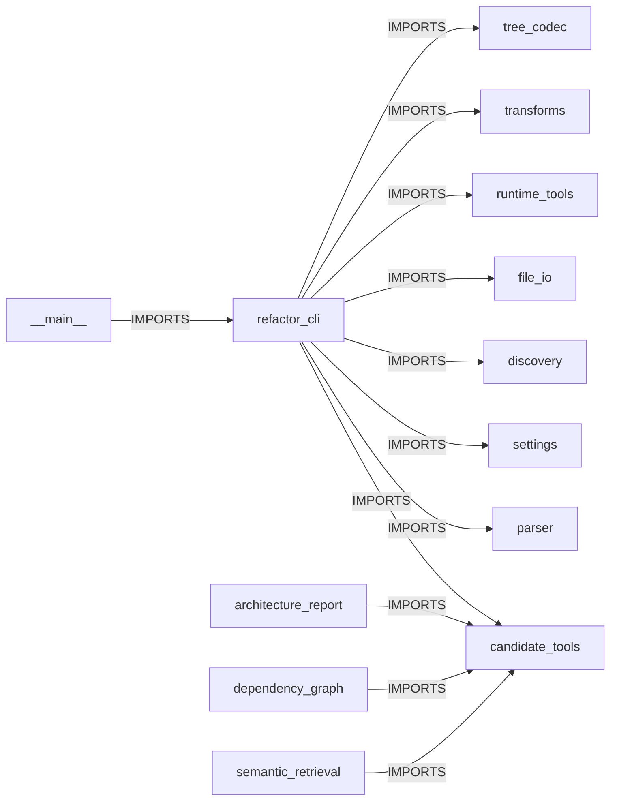
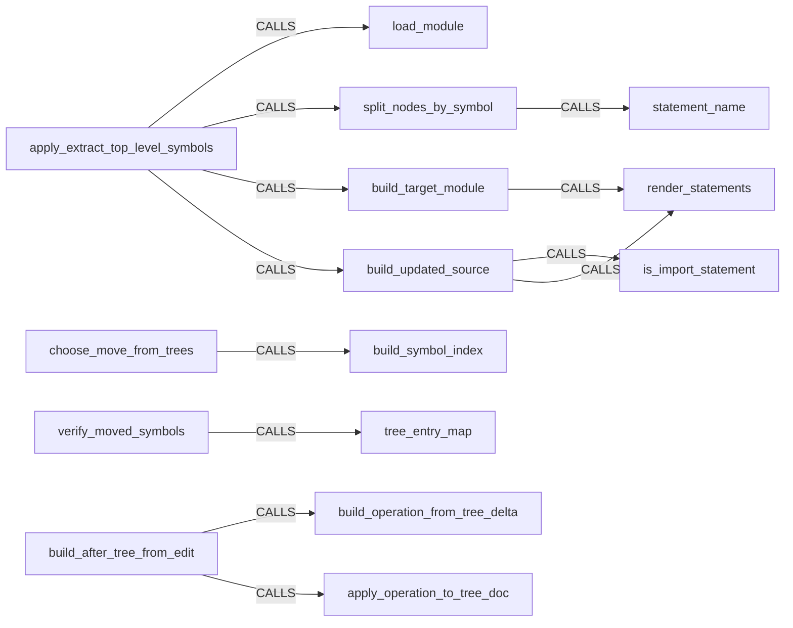
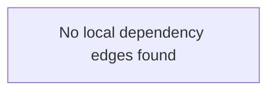
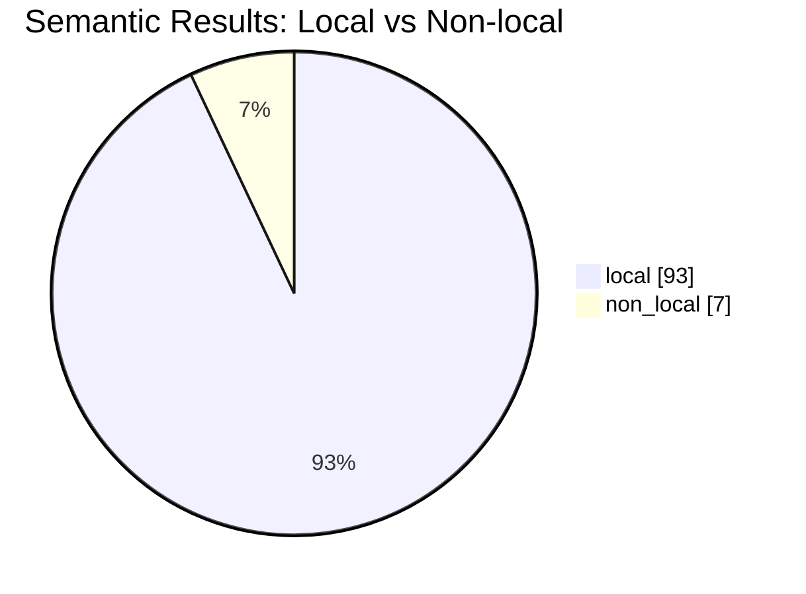

# Candidate Analysis Report

Generated: 2026-09-16T18:44:34

Project: `refactor_cli`

This report converts the raw Phase A candidate artifacts into a human-readable summary so the merit of the output can be checked quickly.

## Status

Overall readiness: **REVIEWABLE**

Safe for manual exploration: **YES**

Safe for automated refactoring: **NO**

Scope: `src/refactor_cli`

Configured/staged files: **19** 
AST parsed files: **19** 
AST internal import edges: **40** 
AST external imports: **68** 
Partial parses: **0** 
Files not indexed: **0** 
Out-of-scope dependency rows discarded: **18** 
Semantic rows: raw **100**, local **93**, non-local **7**, discarded **0**
AST/CBM imports: **39** matched of AST **40** and CBM **39**

Main issue: Some relationships leave the configured corpus; they are treated as external dependencies and are excluded from internal refactoring evidence.

Next action: Inspect the external dependency list and expand configuration only when those files are part of the intended refactoring boundary.

| Module | Status |
|---|---|
| scope_baseline | OK |
| source_index | OK |
| dependency_graph | DEGRADED |
| semantic_retrieval | DEGRADED |
| architecture_report | OK |
| coderag_validate | SKIP |

## Scope Contract

The analysis corpus is defined by the configured file set. Repository files outside
that set are not analyzed. They appear only as external dependencies when imports
from configured files point to them.

- Configuration source: `/workspace/refactor_cli/.refactor/config.json`
- Project root resolved from configuration: `/workspace/refactor_cli`
- Include patterns: `['src/**/*.py']`
- Exclude patterns: `['.venv/**', '**/__pycache__/**', 'build/**', 'dist/**']`
- Candidate package scope: `src/refactor_cli`
- Qualified-name scope: `refactor_cli.src.refactor_cli`
- Configured files: **19**
- AST files analyzed: **19**
- CBM files indexed: **19**
- AST external imports: **68**
- CBM qualified-name exclusions: `['.eval.']`

How the scope is applied:

- `files` resolves the include/exclude patterns and establishes the file manifest.
- AST analysis parses that manifest and classifies imports as internal or external.
- CBM indexes a temporary corpus containing only that manifest.
- Dependency queries use the qualified-name scope and post-query endpoint filtering.
- Semantic results are counted by path; non-local or excluded rows are not trusted as internal evidence.

To include an external dependency in the analysis, change the configured include
patterns and rerun Phase A. Do not infer scope expansion from a search hit alone.

## Degradation Grades

`DEGRADED` is accompanied by a measured loss, not just a boolean warning. The
format is `affected / total`, where coverage is the accepted share of the total.

| Capability | Affected / Total | Coverage | Loss | Grade |
|---|---:|---:|---:|---|
| configured files | 0 / 19 | 100.0% | 0.0% | NONE |
| AST/CBM import agreement | 1 / 40 | 97.5% | 2.5% | MODERATE |
| semantic locality | 7 / 100 | 93.0% | 7.0% | MAJOR |

Grade thresholds: `NONE` = 0% loss, `MINOR` = up to 1%, `MODERATE` = up to 5%,
`MAJOR` = up to 20%, and `CRITICAL` = above 20%. A zero denominator is
`NOT_MEASURABLE`. For example, 1 missing item out of 1000 is `MINOR`; 99 out of
100 is `CRITICAL`.

Example:
- Rerun the pipeline with `refactor-cli candidate-phase-a --config .refactor/config.json`.
- Then render the report with `refactor-cli candidate-report --config .refactor/config.json`.
- If a module is FAIL, start with the failed artifact rather than the report itself.

## Artifact Sizes

| Artifact | Bytes |
|---|---:|
| architecture_report.json | 6505 |
| dependency_graph.json | 122457 |
| evaluation.json | 1540 |
| scope_baseline.json | 15436 |
| semantic_retrieval.json | 108356 |
| source_index.json | 8072 |
| summary.json | 642 |

Example:
- Larger JSON files usually mean broader graph output or more search hits.
- Open the matching artifact in `.refactor/analysis/candidates/` when you need raw rows or payload fields.
- Compare `semantic_retrieval.json` against `dependency_graph.json` to see ranking vs. raw edges.

## What The Raw Files Mean

- `source_index.json`: index health and coverage
- `dependency_graph.json`: raw edge extraction
- `semantic_retrieval.json`: ranked and grouped search hits
- `architecture_report.json`: highest-value human summary
- `summary.json`: pass/fail snapshot

Examples:
- If `semantic_retrieval.json` looks noisy, run `refactor-cli candidate-search --label Class` and tighten the query.
- If `source_index.json` is wrong, check `.refactor/config.json` and rerun Phase A.
- If you only need the architecture summary, open `architecture_report.json` first.

## Evaluation Matrix

| Artifact | Candidate | Input Used | Output Produced | How To Interpret |
|---|---|---|---|---|
| source_index.json | codebase-memory-mcp | Config-scoped staging repo from .refactor/config.json, files=19 files; sample=src/refactor_cli/__init__.py, src/refactor_cli/__main__.py, src/refactor_cli/analysis/architecture_report.py | Indexed graph metadata: node/edge counts, exclusions, parse warnings, project registration | Tells us whether downstream graph outputs are trustworthy enough to inspect and whether indexing stayed inside the configured file set |
| dependency_graph.json | codebase-memory-mcp | MATCH (s)-[r:CALLS|IMPORTS|INHERITS]->(t) WHERE coalesce(s.qn, s.name) STARTS WITH 'refactor_cli.src.refactor_cli' AND NOT coalesce(s.qn, s.name) CONTAINS '.eval.' AND NOT coalesce(t.qn, t.name) CONTAINS '.eval.' RETURN coalesce(s.qn, s.name) AS source, type(r) AS relation, coalesce(t.qn, t.name) AS target | Raw CALLS/IMPORTS/INHERITS edge rows capped at max_rows | Useful as machine graph data, but broad queries can mix target code with indexed evaluation repos |
| semantic_retrieval.json | codebase-memory-mcp | semantic terms=['dependency', 'module', 'architecture', 'transformation', 'quality metrics'], scope hint=src/refactor_cli | Grouped structural matches plus semantic ranking rows with scores | Good for discoverability, but current broad corpus makes semantic ranking noisy |
| architecture_report.json | codebase-memory-mcp | get_architecture(aspects=overview) on the configured corpus and scoped path re-query | Human-readable counts, hotspots, clusters, node labels, edge types | Most useful artifact for quickly understanding structure and central coordination points |

Observation:
- This makes the pipeline traceable. Each artifact can now be judged by the exact input it used, the candidate that produced it, and the meaning of the output.

Example:
- To inspect a specific artifact, run the matching wrapper command instead of opening the JSON first.
- For discovery questions, `candidate-search` is the shortest path.
- For a full structural refresh, use `candidate-phase-a` and then `candidate-report`.

## Readiness Checklist

| Capability | Status |
|---|---|
| Indexing and project registration | OK |
| Scoped architecture extraction | OK |
| AST/CBM module import agreement | DEGRADED |
| Scoped dependency extraction | DEGRADED |
| Scoped semantic retrieval signal | DEGRADED |
| CodeRAG validation | SKIP |
| Persistent daemon mode | SKIP |

Policy note:
- Persistent daemon mode is intentionally not part of this project's operating model.
- Current scope policy: file scope `src/refactor_cli`, qn scope `refactor_cli.src.refactor_cli`, excluded qn substrings `['.eval.']`.

## AST / CBM Agreement

- Matched internal module imports: 39
- AST internal import edges: 40
- CBM internal import edges: 39
- Missing from CBM: 1
- Extra in CBM: 0

Differences:
- Missing from CBM: `refactor_cli` -> `refactor_cli.cli.parser`

An agreement status of `DEGRADED` blocks automated refactoring until each difference
is explained as an AST limitation, provider limitation, or configured-scope issue.

Examples:
- `LOW_SIGNAL` means the semantic query should be narrowed or rewritten.
- `PARTIAL` on dependency extraction usually means the QN scope needs adjustment.
- `OUT_OF_SCOPE` on daemon mode means you can ignore that item for this project.

## Index Health

- Indexed nodes: 229
- Indexed edges: 1058
- Excluded directories shown by the tool: .git
- Partial parse count: 0
- Not indexed file count: 0

Observation:
- The index succeeded and is large enough for meaningful graph analysis.
- The corpus may include auxiliary folders beyond `src/refactor_cli`, so raw full-project results are noisier than the scoped package.

Example:
- If this section shows extra noise, try `refactor-cli candidate-search --scope-path src/refactor_cli --label Class`.
- Add `--cbm-options "--include-connected"` when you want CBM to show connected context around the matches.
- Use `--cbm-options "--min-degree 1"` to suppress weaker graph noise.

## Configured-Corpus Architecture Snapshot

- Languages detected in the indexed corpus: Python=19
- This describes the isolated configured corpus, not the surrounding repository.

Example:
- This snapshot is useful as a sanity check on the configured analysis corpus.
- Expand `python_files.include` only when an external dependency becomes part of the intended refactoring boundary.
- For a tighter class view, add `--label Class`.

## Scoped Architecture For `src/refactor_cli`

- Scoped total nodes: 214
- Scoped total edges: 647
- Entry point: refactor_cli.src.refactor_cli.main src/refactor_cli/__init__.py

Top scoped edge types:
- CALLS=231, DEFINES=191, IMPORTS=86, SEMANTICALLY_RELATED=80, CONTAINS_FILE=19, USAGE=11

Hotspots:
- refactor_cli.src.refactor_cli.analysis.candidate_tools.run_cbm_tool 12
- refactor_cli.src.refactor_cli.discovery.resolve_project_root 7
- refactor_cli.src.refactor_cli.discovery.load_config 7
- refactor_cli.src.refactor_cli.config.settings._config_or_default 5
- refactor_cli.src.refactor_cli.config.settings._load_optional_config 5
- refactor_cli.src.refactor_cli.discovery.discover_python_files 5
- refactor_cli.src.refactor_cli.config.settings._resolve_optional_project_root 4
- refactor_cli.src.refactor_cli.config.settings._candidate_analysis_config 4

Clusters:
- 5 src 44 0.8033 build_candidate_report;_mermaid_scoped_edges;_extract_text_content;_architecture_text;_parse_section_lines src CALLS
- 1 src 28 0.7955 run_tree_transition;cmd_apply_tree_patch;cmd_apply_tree_edit;post_apply_safeguards;ensure_runtime_dependencies src CALLS
- 3 src 23 0.6731 _resolve_candidate_search_settings;_resolve_candidate_phase_a_settings;load_config;_resolve_candidate_report_settings;_load_optional_config src CALLS
- 0 src 18 0.7308 generate_tree_payload;apply_extract_top_level_symbols;write_tree_yaml;build_updated_source;ensure_parent src CALLS
- 2 src 18 0.5 cmd_candidate_phase_a;resolve_project_root;run_source_index;discover_python_files;cmd_format src CALLS
- 6 src 15 0.5484 run_cbm_tool;_configured_semantic_profiles_summary;_scope_filter;_scoped_dependency_edges;_scoped_module_dependency_edges src CALLS

Entry points:
- refactor_cli.src.refactor_cli.main src/refactor_cli/__init__.py

Observation:
- The real package is a compact Python CLI package.
- The central coordination points are discovery/config/file-writing helpers and the candidate integration runner.

Example:
- Use `refactor-cli candidate-search --scope-path src/refactor_cli --label Function` to inspect the implementation entrypoints behind this section.
- If you need more context around a result, add `--cbm-options "--include-connected"`.

## Scoped Module Dependencies

- Data source: **AST scope baseline**
- Unique module import edges: **40**
- Meaning: each edge is a module importing another module inside the configured scope.
- This is not a function call graph; use the next section for function-level calls.

Highest fan-out modules:
- refactor_cli.cli.commands (13)
- refactor_cli (8)
- refactor_cli.transforms (4)
- refactor_cli.analysis.source_index (2)
- refactor_cli.candidate_report (2)
- refactor_cli.cli.parser (2)

Highest fan-in modules:
- refactor_cli.analysis.candidate_tools (7)
- refactor_cli.file_io (6)
- refactor_cli.discovery (5)
- refactor_cli.runtime_tools (4)
- refactor_cli (3)
- refactor_cli.config.settings (2)

Observation:
- Module-level imports show how the package is stitched together structurally.
- AST is the factual fallback when CBM does not return module `IMPORTS` rows.
- A zero count means no edges were recovered from the named source, not that the package has no imports.

Example:
- Query module relationships directly with `refactor-cli candidate-search --scope-path src/refactor_cli --label Function --cbm-options "--relationship IMPORTS"`.
- Add `--cbm-options "--include-connected"` to include attached context.

## Scoped Function Dependencies

The current stored `dependency_graph.json` is raw and broad. For clarity, this report derives a scoped function-call view from direct CBM graph queries and falls back to local structure only when necessary.

Highest fan-out functions:
- refactor_cli.src.refactor_cli.transforms.apply_extract_top_level_symbols (4)
- refactor_cli.src.refactor_cli.transforms.build_updated_source (2)
- refactor_cli.src.refactor_cli.transforms.build_after_tree_from_edit (2)
- refactor_cli.src.refactor_cli.transforms.split_nodes_by_symbol (1)
- refactor_cli.src.refactor_cli.transforms.build_target_module (1)
- refactor_cli.src.refactor_cli.transforms.choose_move_from_trees (1)

Highest fan-in targets:
- refactor_cli.src.refactor_cli.discovery.render_statements (2)
- refactor_cli.src.refactor_cli.discovery.statement_name (1)
- refactor_cli.src.refactor_cli.discovery.is_import_statement (1)
- refactor_cli.src.refactor_cli.transforms.build_symbol_index (1)
- refactor_cli.src.refactor_cli.transforms.tree_entry_map (1)
- refactor_cli.src.refactor_cli.transforms.build_operation_from_tree_delta (1)

Coherent local edge examples:
- refactor_cli.src.refactor_cli.transforms.split_nodes_by_symbol CALLS refactor_cli.src.refactor_cli.discovery.statement_name
- refactor_cli.src.refactor_cli.transforms.build_target_module CALLS refactor_cli.src.refactor_cli.discovery.render_statements
- refactor_cli.src.refactor_cli.transforms.build_updated_source CALLS refactor_cli.src.refactor_cli.discovery.is_import_statement
- refactor_cli.src.refactor_cli.transforms.build_updated_source CALLS refactor_cli.src.refactor_cli.discovery.render_statements
- refactor_cli.src.refactor_cli.transforms.choose_move_from_trees CALLS refactor_cli.src.refactor_cli.transforms.build_symbol_index
- refactor_cli.src.refactor_cli.transforms.verify_moved_symbols CALLS refactor_cli.src.refactor_cli.transforms.tree_entry_map

Suspicious edge examples:
- No suspicious cross-corpus edges observed in this sample.

Observation:
- The graph can recover useful function-level coordination points when the qualified-name scope is set correctly.
- Function-call edges are good for hotspot inspection, but module imports remain the more stable architectural signal.
- Suspicious cross-corpus edges should still be treated as a scoping or indexing problem, not as trustworthy architecture data.

Example:
- Use `refactor-cli candidate-search --scope-path src/refactor_cli --label Function --cbm-options "--relationship CALLS"` to focus on call flow.
- If the query is too broad, add `--cbm-options "--min-degree 1"`.

## Scoped Class / Model Surface

This section uses the class and method nodes exposed by codebase-memory. In Python repositories this is usually the closest available proxy for model-level structure.

- Class-to-method edges recovered: 0
- Inheritance edges recovered: 0

Classes with the largest method surfaces:
- No class/method surface recovered from the scoped graph.

Inheritance examples:
- No class inheritance edges recovered.

Observation:
- This section is only as rich as the repository's class usage. Function-heavy scripts will naturally produce a sparse model view.
- For dataclass-heavy or OO-heavy projects, this becomes the best high-level view of model boundaries and behavior ownership.

Example:
- Use `refactor-cli candidate-search --scope-path src/refactor_cli --label Class` to inspect the same model surface interactively.
- Add `--cbm-options "--include-connected"` if you want the surrounding function context for a class hit.

## Semantic Retrieval Interpretation

The stored artifact is evaluated as-is, without generating extra example queries unless explicitly requested.

What the output looks like:
- `groups`: files with local matches, each row showing `name`, `label`, `lines`, `in`, `out`
- `semantic.rows`: ranked hits with `qn`, `label`, `file`, and `score`
- In other words, this is ranked graph search output, not a generated answer.

Examples:
- For the configured profile queries, run `refactor-cli candidate-search --profile "Calculation and processing"`.
- For a one-off question, pass `--semantic-query '["simulation","run_model","throughput","servicegrad","kanban"]'`.
- For more context around a hit, add `--cbm-options "--include-connected"`.

How semantic is it?
- The search uses semantic terms, but the answer is still grounded in the indexed graph.
- In this repo, that means the signal is partially semantic and partially structural.
- The score is most useful as a prioritization hint after you already know the package scope.

Configured semantic query intents:

- No configured semantic query profiles.

Configured query findings:
- No profile findings available.

Evaluation scorecard for the baseline scoped search:
- local grouped files: 8
- local grouped rows: 30
- local ranking rows: 93
- non-local ranking rows: 7

- Local grouped hits in `src/refactor_cli`:
- src/refactor_cli/__init__.py: `__file__` (File, in=0, out=0)
- src/refactor_cli/__main__.py: `__file__` (File, in=0, out=0)
- src/refactor_cli/analysis/candidate_tools.py: `_extract_json_line` (Function, in=1, out=0)
- src/refactor_cli/analysis/dependency_graph.py: `EDGE_QUERY` (Variable, in=1, out=0)
- src/refactor_cli/analysis/quality_report.py: `_complexity` (Function, in=1, out=0)
- src/refactor_cli/analysis/quality_report.py: `_cycles` (Function, in=1, out=2)
- src/refactor_cli/analysis/quality_report.py: `_dependency_paths` (Function, in=1, out=2)
- src/refactor_cli/candidate_report.py: `_architecture_text` (Function, in=1, out=1)
- src/refactor_cli/candidate_report.py: `_artifact_size_rows` (Function, in=1, out=1)
- src/refactor_cli/candidate_report.py: `_candidate_input_rows` (Function, in=1, out=2)

- Semantic rows split:
    - local scoped rows: 93
    - non-local rows: 7

Observation:
- The semantic retrieval command works, but the ranking still drifts into .eval candidates in this corpus.
- The grouped local results are the useful part for understanding this project.

What this means in practice:
- Successful execution does not imply meaningful insight.
- For this project, semantic retrieval is best used as package-local discovery plus a raw ranking hint, not as a reliable answer engine.

How to use it here:
- Search with file_pattern=src/refactor_cli/* when you need package-local discovery.
- Treat semantic rows as corpus-wide ranking hints, not as a scoped file filter.
- Use grouped hits to find local files, then inspect the file-level summary and the ranking scores together.
- If the local ratio stays at 0, the query terms are too broad for the package or the corpus is too noisy.

More detail options:
- Use `refactor-cli candidate-search` for ad hoc questions without rebuilding the full report.
- Add `--cbm-options` when you want raw CBM flags such as `--include-connected` or `--relationship CALLS`.
- Use `--scope-path src/refactor_cli` when you want a narrower package-local query than the report default.
- Use `--label Class` to inspect model/data surfaces and `--label Function` to inspect flow and orchestration.
- If the report says LOW_SIGNAL, narrow the terms or add CBM graph constraints such as `--min-degree 1`.

## Practical Conclusions

- The outputs have merit, but only after scoping and summarization.
- `architecture_report.json` plus the scoped module/function/class sections above are the strongest combination for human understanding.
- `dependency_graph.json` and `semantic_retrieval.json` should still be treated as machine-oriented raw data unless filtered to the target package.
- Demo-style semantic examples are best kept opt-in, because they evaluate tooling behavior rather than describing the target architecture.
- The report should focus on engineering insight first: entrypoints, hotspots, module imports, function coordination points, and class/model surface.

## Optional Provider Note

- CodeRAG validation artifact not present.
