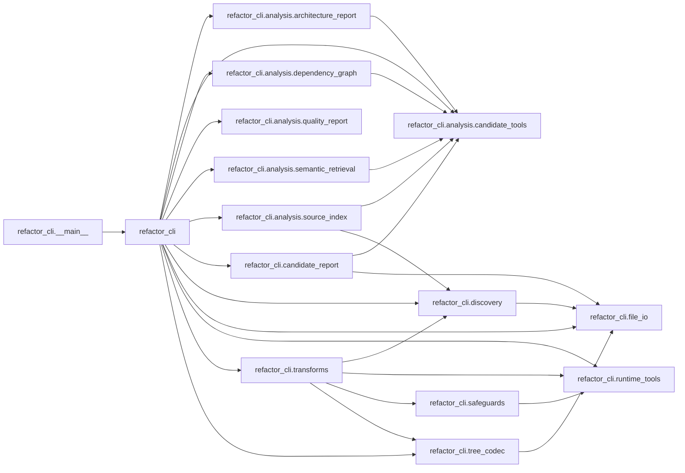

# Refactor Quality Report: `refactor_cli`

Scope: `/workspace/refactor_cli/src/refactor_cli`

## Move Candidates

- `refactor_cli`: high fan-out (12)
- `refactor_cli.transforms`: high fan-out (4)
- `refactor_cli.analysis.source_index`: high fan-out (2)
- `refactor_cli.candidate_report`: high fan-out (2)

## Module Dependencies

| Module | Fan-in | Fan-out | Imports |
|---|---:|---:|---|
| `refactor_cli` | 1 | 12 | `refactor_cli.analysis.architecture_report`, `refactor_cli.analysis.candidate_tools`, `refactor_cli.analysis.dependency_graph`, `refactor_cli.analysis.quality_report`, `refactor_cli.analysis.semantic_retrieval`, `refactor_cli.analysis.source_index`, `refactor_cli.candidate_report`, `refactor_cli.discovery`, `refactor_cli.file_io`, `refactor_cli.runtime_tools`, `refactor_cli.transforms`, `refactor_cli.tree_codec` |
| `refactor_cli.__main__` | 0 | 1 | `refactor_cli` |
| `refactor_cli.analysis.architecture_report` | 1 | 1 | `refactor_cli.analysis.candidate_tools` |
| `refactor_cli.analysis.candidate_tools` | 6 | 0 | - |
| `refactor_cli.analysis.dependency_graph` | 1 | 1 | `refactor_cli.analysis.candidate_tools` |
| `refactor_cli.analysis.quality_report` | 1 | 0 | - |
| `refactor_cli.analysis.semantic_retrieval` | 1 | 1 | `refactor_cli.analysis.candidate_tools` |
| `refactor_cli.analysis.source_index` | 1 | 2 | `refactor_cli.analysis.candidate_tools`, `refactor_cli.discovery` |
| `refactor_cli.candidate_report` | 1 | 2 | `refactor_cli.analysis.candidate_tools`, `refactor_cli.file_io` |
| `refactor_cli.discovery` | 3 | 1 | `refactor_cli.file_io` |
| `refactor_cli.file_io` | 4 | 0 | - |
| `refactor_cli.runtime_tools` | 3 | 0 | - |
| `refactor_cli.safeguards` | 1 | 1 | `refactor_cli.runtime_tools` |
| `refactor_cli.transforms` | 1 | 4 | `refactor_cli.discovery`, `refactor_cli.runtime_tools`, `refactor_cli.safeguards`, `refactor_cli.tree_codec` |
| `refactor_cli.tree_codec` | 2 | 1 | `refactor_cli.file_io` |

## Cycles

- None

## Dependency Paths

- refactor_cli -> refactor_cli.analysis.architecture_report -> refactor_cli.analysis.candidate_tools
- refactor_cli -> refactor_cli.analysis.dependency_graph -> refactor_cli.analysis.candidate_tools
- refactor_cli -> refactor_cli.analysis.semantic_retrieval -> refactor_cli.analysis.candidate_tools
- refactor_cli -> refactor_cli.analysis.source_index -> refactor_cli.analysis.candidate_tools
- refactor_cli -> refactor_cli.analysis.source_index -> refactor_cli.discovery
- refactor_cli -> refactor_cli.candidate_report -> refactor_cli.analysis.candidate_tools
- refactor_cli -> refactor_cli.candidate_report -> refactor_cli.file_io
- refactor_cli -> refactor_cli.discovery -> refactor_cli.file_io
- refactor_cli -> refactor_cli.transforms -> refactor_cli.discovery
- refactor_cli -> refactor_cli.transforms -> refactor_cli.runtime_tools

## Dependency Diagram

## Module Sources

- `refactor_cli`: [src/refactor_cli/__init__.py](src/refactor_cli/__init__.py#L1)
- `refactor_cli.__main__`: [src/refactor_cli/__main__.py](src/refactor_cli/__main__.py#L1)
- `refactor_cli.analysis.architecture_report`: [src/refactor_cli/analysis/architecture_report.py](src/refactor_cli/analysis/architecture_report.py#L1)
- `refactor_cli.analysis.candidate_tools`: [src/refactor_cli/analysis/candidate_tools.py](src/refactor_cli/analysis/candidate_tools.py#L1)
- `refactor_cli.analysis.dependency_graph`: [src/refactor_cli/analysis/dependency_graph.py](src/refactor_cli/analysis/dependency_graph.py#L1)
- `refactor_cli.analysis.quality_report`: [src/refactor_cli/analysis/quality_report.py](src/refactor_cli/analysis/quality_report.py#L1)
- `refactor_cli.analysis.semantic_retrieval`: [src/refactor_cli/analysis/semantic_retrieval.py](src/refactor_cli/analysis/semantic_retrieval.py#L1)
- `refactor_cli.analysis.source_index`: [src/refactor_cli/analysis/source_index.py](src/refactor_cli/analysis/source_index.py#L1)
- `refactor_cli.candidate_report`: [src/refactor_cli/candidate_report.py](src/refactor_cli/candidate_report.py#L1)
- `refactor_cli.discovery`: [src/refactor_cli/discovery.py](src/refactor_cli/discovery.py#L1)
- `refactor_cli.file_io`: [src/refactor_cli/file_io.py](src/refactor_cli/file_io.py#L1)
- `refactor_cli.runtime_tools`: [src/refactor_cli/runtime_tools.py](src/refactor_cli/runtime_tools.py#L1)
- `refactor_cli.safeguards`: [src/refactor_cli/safeguards.py](src/refactor_cli/safeguards.py#L1)
- `refactor_cli.transforms`: [src/refactor_cli/transforms.py](src/refactor_cli/transforms.py#L1)
- `refactor_cli.tree_codec`: [src/refactor_cli/tree_codec.py](src/refactor_cli/tree_codec.py#L1)

## Complexity Hotspots

- `src/refactor_cli/candidate_report.py:930` `build_candidate_report`: 28
- `src/refactor_cli/transforms.py:75` `apply_unified_diff_to_text`: 26
- `src/refactor_cli/candidate_report.py:346` `_semantic_profile_payload`: 18
- `src/refactor_cli/candidate_report.py:589` `_fallback_dependency_rows`: 17
- `src/refactor_cli/transforms.py:449` `run_tree_transition`: 17
- `src/refactor_cli/candidate_report.py:630` `_search_hit_dependency_rows`: 15
- `src/refactor_cli/__init__.py:586` `cmd_apply_tree_patch`: 14
- `src/refactor_cli/__init__.py:342` `_resolve_candidate_search_settings`: 13
- `src/refactor_cli/__init__.py:666` `cmd_apply_tree_edit`: 13
- `src/refactor_cli/__init__.py:751` `cmd_candidate_phase_a`: 12

## Duplicates

- None

## Unused Functions

- `src/refactor_cli/__init__.py:68` `_load_optional_config`
- `src/refactor_cli/__init__.py:74` `_candidate_analysis_config`
- `src/refactor_cli/__init__.py:79` `_config_or_default`
- `src/refactor_cli/__init__.py:87` `_resolve_path_setting`
- `src/refactor_cli/__init__.py:95` `_resolve_optional_project_root`
- `src/refactor_cli/__init__.py:105` `_find_default_config_path`
- `src/refactor_cli/__init__.py:114` `_semantic_terms_setting`
- `src/refactor_cli/__init__.py:122` `_exclude_substrings_setting`
- `src/refactor_cli/__init__.py:128` `_semantic_query_profiles_setting`
- `src/refactor_cli/__init__.py:158` `_load_summary_if_present`
- `src/refactor_cli/__init__.py:165` `_resolve_candidate_phase_a_settings`
- `src/refactor_cli/__init__.py:235` `_resolve_candidate_report_settings`
- `src/refactor_cli/__init__.py:287` `_project_name_default`
- `src/refactor_cli/__init__.py:294` `_parse_semantic_query`
- `src/refactor_cli/__init__.py:312` `_parse_cbm_options`
- `src/refactor_cli/__init__.py:332` `_profile_terms_setting`
- `src/refactor_cli/__init__.py:342` `_resolve_candidate_search_settings`
- `src/refactor_cli/__init__.py:423` `choose_operation`
- `src/refactor_cli/__init__.py:458` `extract_paths_from_tree_patch`
- `src/refactor_cli/__init__.py:473` `cmd_init`
- `src/refactor_cli/__init__.py:534` `cmd_files`
- `src/refactor_cli/__init__.py:547` `cmd_tree`
- `src/refactor_cli/__init__.py:563` `cmd_format`
- `src/refactor_cli/__init__.py:586` `cmd_apply_tree_patch`
- `src/refactor_cli/__init__.py:666` `cmd_apply_tree_edit`
- `src/refactor_cli/__init__.py:751` `cmd_candidate_phase_a`
- `src/refactor_cli/__init__.py:863` `cmd_candidate_report`
- `src/refactor_cli/__init__.py:887` `cmd_candidate_search`
- `src/refactor_cli/__init__.py:929` `cmd_quality_report`
- `src/refactor_cli/__init__.py:956` `build_parser`
- `src/refactor_cli/analysis/architecture_report.py:7` `collect_architecture_report`
- `src/refactor_cli/analysis/candidate_tools.py:8` `resolve_cbm_binary`
- `src/refactor_cli/analysis/candidate_tools.py:28` `_flag_name`
- `src/refactor_cli/analysis/candidate_tools.py:32` `_flag_value`
- `src/refactor_cli/analysis/candidate_tools.py:40` `_extract_json_line`
- `src/refactor_cli/analysis/candidate_tools.py:52` `run_cbm_tool`
- `src/refactor_cli/analysis/dependency_graph.py:15` `collect_dependency_graph`
- `src/refactor_cli/analysis/quality_report.py:11` `_python_files`
- `src/refactor_cli/analysis/quality_report.py:21` `_module_name`
- `src/refactor_cli/analysis/quality_report.py:30` `_resolve_relative`
- `src/refactor_cli/analysis/quality_report.py:36` `_nearest`
- `src/refactor_cli/analysis/quality_report.py:45` `_imports`
- `src/refactor_cli/analysis/quality_report.py:69` `_complexity`
- `src/refactor_cli/analysis/quality_report.py:76` `_normalized_hash`
- `src/refactor_cli/analysis/quality_report.py:94` `_unused_functions`
- `src/refactor_cli/analysis/quality_report.py:108` `collect_quality_report`
- `src/refactor_cli/analysis/quality_report.py:166` `_cycles`
- `src/refactor_cli/analysis/quality_report.py:182` `_dependency_paths`
- `src/refactor_cli/analysis/quality_report.py:197` `_mermaid`
- `src/refactor_cli/analysis/quality_report.py:209` `render_quality_report`
- `src/refactor_cli/analysis/quality_report.py:243` `write_quality_report`
- `src/refactor_cli/analysis/quality_report.py:78` `visit_Name`
- `src/refactor_cli/analysis/quality_report.py:81` `visit_arg`
- `src/refactor_cli/analysis/quality_report.py:84` `visit_Constant`
- `src/refactor_cli/analysis/semantic_retrieval.py:7` `collect_semantic_retrieval`
- `src/refactor_cli/analysis/source_index.py:16` `_project_name_from_root`
- `src/refactor_cli/analysis/source_index.py:20` `run_source_index`
- `src/refactor_cli/analysis/source_index.py:86` `run_coderag_validate_only`
- `src/refactor_cli/candidate_report.py:15` `_extract_text_content`
- `src/refactor_cli/candidate_report.py:25` `_architecture_text`
- `src/refactor_cli/candidate_report.py:29` `_parse_section_counts`
- `src/refactor_cli/candidate_report.py:51` `_parse_section_lines`
- `src/refactor_cli/candidate_report.py:66` `_parse_scalar_value`
- `src/refactor_cli/candidate_report.py:74` `_status_label`
- `src/refactor_cli/candidate_report.py:82` `_artifact_size_rows`
- `src/refactor_cli/candidate_report.py:89` `_top_local_groups`
- `src/refactor_cli/candidate_report.py:107` `_semantic_group_summary`
- `src/refactor_cli/candidate_report.py:124` `_semantic_noise_summary`
- `src/refactor_cli/candidate_report.py:148` `_semantic_usage_guidance`
- `src/refactor_cli/candidate_report.py:157` `_detail_options_lines`
- `src/refactor_cli/candidate_report.py:167` `_semantic_query_profiles`
- `src/refactor_cli/candidate_report.py:193` `_profile_terms`
- `src/refactor_cli/candidate_report.py:203` `_profile_scope`
- `src/refactor_cli/candidate_report.py:207` `_configured_semantic_profiles_summary`
- `src/refactor_cli/candidate_report.py:262` `_configured_semantic_profiles_table`
- `src/refactor_cli/candidate_report.py:277` `_configured_semantic_profile_findings`
- `src/refactor_cli/candidate_report.py:304` `_scope_qn_prefix`
- `src/refactor_cli/candidate_report.py:309` `_scope_filter`
- `src/refactor_cli/candidate_report.py:313` `_parse_relation_rows`
- `src/refactor_cli/candidate_report.py:338` `_normalize_scoped_name`
- `src/refactor_cli/candidate_report.py:346` `_semantic_profile_payload`
- `src/refactor_cli/candidate_report.py:422` `_structural_profile_payload`
- `src/refactor_cli/candidate_report.py:433` `_structural_search_payload`
- `src/refactor_cli/candidate_report.py:462` `_scoped_architecture`
- `src/refactor_cli/candidate_report.py:477` `_scoped_dependency_edges`
- `src/refactor_cli/candidate_report.py:494` `_scoped_module_dependency_edges`
- `src/refactor_cli/candidate_report.py:512` `_scoped_class_method_edges`
- `src/refactor_cli/candidate_report.py:529` `_scoped_class_inheritance_edges`
- `src/refactor_cli/candidate_report.py:547` `_scoped_semantic_search`
- `src/refactor_cli/candidate_report.py:569` `_dependency_rows_from_text`
- `src/refactor_cli/candidate_report.py:573` `_short_name`
- `src/refactor_cli/candidate_report.py:577` `_module_name_for_file`
- `src/refactor_cli/candidate_report.py:589` `_fallback_dependency_rows`
- `src/refactor_cli/candidate_report.py:630` `_search_hit_dependency_rows`
- `src/refactor_cli/candidate_report.py:674` `_mermaid_status`
- `src/refactor_cli/candidate_report.py:683` `_mermaid_artifact_sizes`
- `src/refactor_cli/candidate_report.py:691` `_mermaid_scoped_labels`
- `src/refactor_cli/candidate_report.py:699` `_mermaid_scoped_edges`
- `src/refactor_cli/candidate_report.py:715` `_relation_counters`
- `src/refactor_cli/candidate_report.py:750` `_top_counter_lines`
- `src/refactor_cli/candidate_report.py:754` `_entry_point_lines`
- `src/refactor_cli/candidate_report.py:759` `_class_surface_lines`
- `src/refactor_cli/candidate_report.py:767` `_optional_demo_artifacts_section`
- `src/refactor_cli/candidate_report.py:790` `_mermaid_structural_hits`
- `src/refactor_cli/candidate_report.py:818` `_mermaid_semantic_signal`
- `src/refactor_cli/candidate_report.py:830` `_candidate_input_rows`
- `src/refactor_cli/candidate_report.py:876` `_markdown_input_table`
- `src/refactor_cli/candidate_report.py:888` `_markdown_profile_table`
- `src/refactor_cli/candidate_report.py:900` `_search_hit_dependency_block`
- `src/refactor_cli/candidate_report.py:912` `_example_edge_lines`
- `src/refactor_cli/candidate_report.py:926` `_line_list`
- `src/refactor_cli/candidate_report.py:930` `build_candidate_report`
- `src/refactor_cli/candidate_report.py:803` `node_id`
- `src/refactor_cli/discovery.py:8` `load_config`
- `src/refactor_cli/discovery.py:16` `resolve_project_root`
- `src/refactor_cli/discovery.py:21` `discover_python_files`
- `src/refactor_cli/discovery.py:42` `load_module`
- `src/refactor_cli/discovery.py:46` `statement_name`
- `src/refactor_cli/discovery.py:60` `is_import_statement`
- `src/refactor_cli/discovery.py:64` `render_statements`
- `src/refactor_cli/discovery.py:73` `build_tree`
- `src/refactor_cli/discovery.py:99` `print_tree`
- `src/refactor_cli/discovery.py:108` `generate_tree_payload`
- `src/refactor_cli/file_io.py:8` `ensure_parent`
- `src/refactor_cli/file_io.py:12` `load_json`
- `src/refactor_cli/file_io.py:16` `write_json`
- `src/refactor_cli/file_io.py:21` `load_yaml`
- `src/refactor_cli/file_io.py:27` `write_yaml`
- `src/refactor_cli/file_io.py:33` `yaml_text`
- `src/refactor_cli/file_io.py:37` `archive_patch`
- `src/refactor_cli/runtime_tools.py:8` `_python_module_available`
- `src/refactor_cli/runtime_tools.py:12` `resolve_emend_runner`
- `src/refactor_cli/runtime_tools.py:29` `ensure_runtime_dependencies`
- `src/refactor_cli/runtime_tools.py:56` `run_formatter_on_file`
- `src/refactor_cli/runtime_tools.py:61` `run_compile_check_on_file`
- `src/refactor_cli/runtime_tools.py:66` `run_autoimport_on_file`
- `src/refactor_cli/runtime_tools.py:80` `run_lint_check_on_file`
- `src/refactor_cli/runtime_tools.py:108` `_run_ruff_fix_imports`
- `src/refactor_cli/safeguards.py:11` `post_apply_safeguards`
- `src/refactor_cli/transforms.py:19` `split_nodes_by_symbol`
- `src/refactor_cli/transforms.py:33` `build_target_module`
- `src/refactor_cli/transforms.py:44` `build_updated_source`
- `src/refactor_cli/transforms.py:75` `apply_unified_diff_to_text`
- `src/refactor_cli/transforms.py:168` `build_symbol_index`
- `src/refactor_cli/transforms.py:177` `tree_entry_map`
- `src/refactor_cli/transforms.py:181` `choose_move_from_trees`
- `src/refactor_cli/transforms.py:217` `build_operation_from_tree_delta`
- `src/refactor_cli/transforms.py:231` `apply_operation_to_tree_doc`
- `src/refactor_cli/transforms.py:264` `verify_moved_symbols`
- `src/refactor_cli/transforms.py:274` `tree_docs_differ`
- `src/refactor_cli/transforms.py:280` `build_after_tree_from_edit`
- `src/refactor_cli/transforms.py:315` `detect_file_deletions_from_trees`
- `src/refactor_cli/transforms.py:321` `apply_extract_top_level_symbols`
- `src/refactor_cli/transforms.py:346` `_strip_self_imports`
- `src/refactor_cli/transforms.py:399` `apply_extract_top_level_symbols_emend`
- `src/refactor_cli/transforms.py:449` `run_tree_transition`
- `src/refactor_cli/transforms.py:76` `apply_by_chunk_replace`
- `src/refactor_cli/tree_codec.py:8` `_node_to_compact`
- `src/refactor_cli/tree_codec.py:16` `_compact_to_node`
- `src/refactor_cli/tree_codec.py:29` `write_tree_yaml`
- `src/refactor_cli/tree_codec.py:43` `load_tree_yaml`
