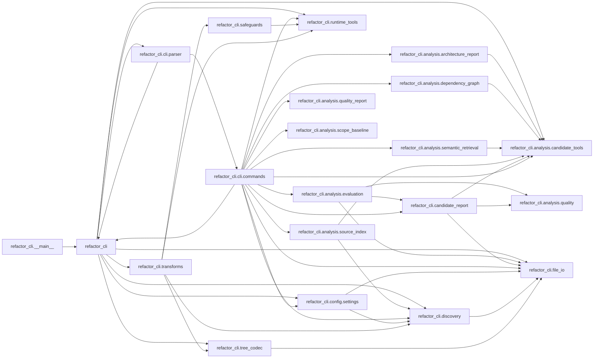

# Refactor Quality Report: `refactor_cli`

Scope: `/workspace/refactor_cli/src/refactor_cli`

## Move Candidates

- `refactor_cli.cli.commands`: high fan-out (14)
- `refactor_cli`: high fan-out (8)
- `refactor_cli.transforms`: high fan-out (4)
- `refactor_cli.analysis.evaluation`: high fan-out (3)
- `refactor_cli.candidate_report`: high fan-out (3)
- `refactor_cli.analysis.source_index`: high fan-out (2)
- `refactor_cli.cli.parser`: high fan-out (2)
- `refactor_cli.config.settings`: high fan-out (2)

## Module Dependencies

| Module | Fan-in | Fan-out | Imports |
|---|---:|---:|---|
| `refactor_cli` | 3 | 8 | `refactor_cli.analysis.candidate_tools`, `refactor_cli.cli.parser`, `refactor_cli.config.settings`, `refactor_cli.discovery`, `refactor_cli.file_io`, `refactor_cli.runtime_tools`, `refactor_cli.transforms`, `refactor_cli.tree_codec` |
| `refactor_cli.__main__` | 0 | 1 | `refactor_cli` |
| `refactor_cli.analysis.architecture_report` | 1 | 1 | `refactor_cli.analysis.candidate_tools` |
| `refactor_cli.analysis.candidate_tools` | 7 | 0 | - |
| `refactor_cli.analysis.dependency_graph` | 1 | 1 | `refactor_cli.analysis.candidate_tools` |
| `refactor_cli.analysis.evaluation` | 1 | 3 | `refactor_cli.analysis.quality`, `refactor_cli.candidate_report`, `refactor_cli.file_io` |
| `refactor_cli.analysis.quality` | 2 | 0 | - |
| `refactor_cli.analysis.quality_report` | 1 | 0 | - |
| `refactor_cli.analysis.scope_baseline` | 1 | 0 | - |
| `refactor_cli.analysis.semantic_retrieval` | 1 | 1 | `refactor_cli.analysis.candidate_tools` |
| `refactor_cli.analysis.source_index` | 1 | 2 | `refactor_cli.analysis.candidate_tools`, `refactor_cli.discovery` |
| `refactor_cli.candidate_report` | 2 | 3 | `refactor_cli.analysis.candidate_tools`, `refactor_cli.analysis.quality`, `refactor_cli.file_io` |
| `refactor_cli.cli.commands` | 1 | 14 | `refactor_cli`, `refactor_cli.analysis.architecture_report`, `refactor_cli.analysis.candidate_tools`, `refactor_cli.analysis.dependency_graph`, `refactor_cli.analysis.evaluation`, `refactor_cli.analysis.quality_report`, `refactor_cli.analysis.scope_baseline`, `refactor_cli.analysis.semantic_retrieval`, `refactor_cli.analysis.source_index`, `refactor_cli.candidate_report`, `refactor_cli.config.settings`, `refactor_cli.discovery`, `refactor_cli.file_io`, `refactor_cli.runtime_tools` |
| `refactor_cli.cli.parser` | 1 | 2 | `refactor_cli`, `refactor_cli.cli.commands` |
| `refactor_cli.config.settings` | 2 | 2 | `refactor_cli.discovery`, `refactor_cli.file_io` |
| `refactor_cli.discovery` | 5 | 1 | `refactor_cli.file_io` |
| `refactor_cli.file_io` | 7 | 0 | - |
| `refactor_cli.runtime_tools` | 4 | 0 | - |
| `refactor_cli.safeguards` | 1 | 1 | `refactor_cli.runtime_tools` |
| `refactor_cli.transforms` | 1 | 4 | `refactor_cli.discovery`, `refactor_cli.runtime_tools`, `refactor_cli.safeguards`, `refactor_cli.tree_codec` |
| `refactor_cli.tree_codec` | 2 | 1 | `refactor_cli.file_io` |

## Cycles

- refactor_cli -> refactor_cli.cli.parser
- refactor_cli -> refactor_cli.cli.commands -> refactor_cli.cli.parser

## Dependency Paths

- refactor_cli -> refactor_cli.cli.parser -> refactor_cli.cli.commands
- refactor_cli -> refactor_cli.config.settings -> refactor_cli.discovery
- refactor_cli -> refactor_cli.config.settings -> refactor_cli.file_io
- refactor_cli -> refactor_cli.discovery -> refactor_cli.file_io
- refactor_cli -> refactor_cli.transforms -> refactor_cli.discovery
- refactor_cli -> refactor_cli.transforms -> refactor_cli.runtime_tools
- refactor_cli -> refactor_cli.transforms -> refactor_cli.safeguards
- refactor_cli -> refactor_cli.transforms -> refactor_cli.tree_codec
- refactor_cli -> refactor_cli.tree_codec -> refactor_cli.file_io
- refactor_cli.__main__ -> refactor_cli -> refactor_cli.analysis.candidate_tools

## Dependency Diagram

## Module Sources

- `refactor_cli`: [src/refactor_cli/__init__.py](src/refactor_cli/__init__.py#L1)
- `refactor_cli.__main__`: [src/refactor_cli/__main__.py](src/refactor_cli/__main__.py#L1)
- `refactor_cli.analysis.architecture_report`: [src/refactor_cli/analysis/architecture_report.py](src/refactor_cli/analysis/architecture_report.py#L1)
- `refactor_cli.analysis.candidate_tools`: [src/refactor_cli/analysis/candidate_tools.py](src/refactor_cli/analysis/candidate_tools.py#L1)
- `refactor_cli.analysis.dependency_graph`: [src/refactor_cli/analysis/dependency_graph.py](src/refactor_cli/analysis/dependency_graph.py#L1)
- `refactor_cli.analysis.evaluation`: [src/refactor_cli/analysis/evaluation.py](src/refactor_cli/analysis/evaluation.py#L1)
- `refactor_cli.analysis.quality`: [src/refactor_cli/analysis/quality.py](src/refactor_cli/analysis/quality.py#L1)
- `refactor_cli.analysis.quality_report`: [src/refactor_cli/analysis/quality_report.py](src/refactor_cli/analysis/quality_report.py#L1)
- `refactor_cli.analysis.scope_baseline`: [src/refactor_cli/analysis/scope_baseline.py](src/refactor_cli/analysis/scope_baseline.py#L1)
- `refactor_cli.analysis.semantic_retrieval`: [src/refactor_cli/analysis/semantic_retrieval.py](src/refactor_cli/analysis/semantic_retrieval.py#L1)
- `refactor_cli.analysis.source_index`: [src/refactor_cli/analysis/source_index.py](src/refactor_cli/analysis/source_index.py#L1)
- `refactor_cli.candidate_report`: [src/refactor_cli/candidate_report.py](src/refactor_cli/candidate_report.py#L1)
- `refactor_cli.cli.commands`: [src/refactor_cli/cli/commands.py](src/refactor_cli/cli/commands.py#L1)
- `refactor_cli.cli.parser`: [src/refactor_cli/cli/parser.py](src/refactor_cli/cli/parser.py#L1)
- `refactor_cli.config.settings`: [src/refactor_cli/config/settings.py](src/refactor_cli/config/settings.py#L1)
- `refactor_cli.discovery`: [src/refactor_cli/discovery.py](src/refactor_cli/discovery.py#L1)
- `refactor_cli.file_io`: [src/refactor_cli/file_io.py](src/refactor_cli/file_io.py#L1)
- `refactor_cli.runtime_tools`: [src/refactor_cli/runtime_tools.py](src/refactor_cli/runtime_tools.py#L1)
- `refactor_cli.safeguards`: [src/refactor_cli/safeguards.py](src/refactor_cli/safeguards.py#L1)
- `refactor_cli.transforms`: [src/refactor_cli/transforms.py](src/refactor_cli/transforms.py#L1)
- `refactor_cli.tree_codec`: [src/refactor_cli/tree_codec.py](src/refactor_cli/tree_codec.py#L1)

## Complexity Hotspots

- `src/refactor_cli/candidate_report.py:1065` `build_candidate_report`: 48
- `src/refactor_cli/transforms.py:75` `apply_unified_diff_to_text`: 26
- `src/refactor_cli/candidate_report.py:435` `_semantic_profile_payload`: 18
- `src/refactor_cli/candidate_report.py:678` `_fallback_dependency_rows`: 17
- `src/refactor_cli/transforms.py:449` `run_tree_transition`: 17
- `src/refactor_cli/candidate_report.py:729` `_search_hit_dependency_rows`: 15
- `src/refactor_cli/__init__.py:510` `cmd_apply_tree_patch`: 14
- `src/refactor_cli/analysis/quality_report.py:94` `_unused_functions`: 14
- `src/refactor_cli/__init__.py:266` `_resolve_candidate_search_settings`: 13
- `src/refactor_cli/__init__.py:590` `cmd_apply_tree_edit`: 13

## Duplicates

- None

## Unused Functions

- `src/refactor_cli/__init__.py:347` `choose_operation`
- `src/refactor_cli/__init__.py:382` `extract_paths_from_tree_patch`
- `src/refactor_cli/__init__.py:397` `cmd_init`
- `src/refactor_cli/__init__.py:458` `cmd_files`
- `src/refactor_cli/__init__.py:471` `cmd_tree`
- `src/refactor_cli/__init__.py:487` `cmd_format`
- `src/refactor_cli/__init__.py:510` `cmd_apply_tree_patch`
- `src/refactor_cli/__init__.py:590` `cmd_apply_tree_edit`
- `src/refactor_cli/analysis/architecture_report.py:7` `collect_architecture_report`
- `src/refactor_cli/analysis/candidate_tools.py:8` `resolve_cbm_binary`
- `src/refactor_cli/analysis/candidate_tools.py:52` `run_cbm_tool`
- `src/refactor_cli/analysis/dependency_graph.py:15` `collect_dependency_graph`
- `src/refactor_cli/analysis/evaluation.py:28` `evaluate_candidate_artifacts`
- `src/refactor_cli/analysis/quality.py:6` `quality_summary`
- `src/refactor_cli/analysis/quality_report.py:120` `collect_quality_report`
- `src/refactor_cli/analysis/quality_report.py:221` `render_quality_report`
- `src/refactor_cli/analysis/quality_report.py:255` `write_quality_report`
- `src/refactor_cli/analysis/scope_baseline.py:42` `collect_scope_baseline`
- `src/refactor_cli/analysis/semantic_retrieval.py:7` `collect_semantic_retrieval`
- `src/refactor_cli/analysis/source_index.py:38` `run_source_index`
- `src/refactor_cli/analysis/source_index.py:107` `run_coderag_validate_only`
- `src/refactor_cli/candidate_report.py:1065` `build_candidate_report`
- `src/refactor_cli/cli/commands.py:28` `cmd_candidate_phase_a`
- `src/refactor_cli/cli/commands.py:149` `cmd_candidate_report`
- `src/refactor_cli/cli/commands.py:173` `cmd_candidate_evaluate`
- `src/refactor_cli/cli/commands.py:195` `cmd_candidate_search`
- `src/refactor_cli/cli/commands.py:237` `cmd_quality_report`
- `src/refactor_cli/cli/parser.py:22` `build_parser`
- `src/refactor_cli/discovery.py:8` `load_config`
- `src/refactor_cli/discovery.py:16` `resolve_project_root`
- `src/refactor_cli/discovery.py:21` `discover_python_files`
- `src/refactor_cli/discovery.py:42` `load_module`
- `src/refactor_cli/discovery.py:46` `statement_name`
- `src/refactor_cli/discovery.py:60` `is_import_statement`
- `src/refactor_cli/discovery.py:64` `render_statements`
- `src/refactor_cli/discovery.py:73` `build_tree`
- `src/refactor_cli/discovery.py:99` `print_tree`
- `src/refactor_cli/discovery.py:108` `generate_tree_payload`
- `src/refactor_cli/file_io.py:8` `ensure_parent`
- `src/refactor_cli/file_io.py:12` `load_json`
- `src/refactor_cli/file_io.py:16` `write_json`
- `src/refactor_cli/file_io.py:21` `load_yaml`
- `src/refactor_cli/file_io.py:27` `write_yaml`
- `src/refactor_cli/file_io.py:33` `yaml_text`
- `src/refactor_cli/file_io.py:37` `archive_patch`
- `src/refactor_cli/runtime_tools.py:12` `resolve_emend_runner`
- `src/refactor_cli/runtime_tools.py:29` `ensure_runtime_dependencies`
- `src/refactor_cli/runtime_tools.py:56` `run_formatter_on_file`
- `src/refactor_cli/runtime_tools.py:61` `run_compile_check_on_file`
- `src/refactor_cli/runtime_tools.py:66` `run_autoimport_on_file`
- `src/refactor_cli/runtime_tools.py:80` `run_lint_check_on_file`
- `src/refactor_cli/safeguards.py:11` `post_apply_safeguards`
- `src/refactor_cli/transforms.py:19` `split_nodes_by_symbol`
- `src/refactor_cli/transforms.py:33` `build_target_module`
- `src/refactor_cli/transforms.py:44` `build_updated_source`
- `src/refactor_cli/transforms.py:75` `apply_unified_diff_to_text`
- `src/refactor_cli/transforms.py:168` `build_symbol_index`
- `src/refactor_cli/transforms.py:177` `tree_entry_map`
- `src/refactor_cli/transforms.py:181` `choose_move_from_trees`
- `src/refactor_cli/transforms.py:217` `build_operation_from_tree_delta`
- `src/refactor_cli/transforms.py:231` `apply_operation_to_tree_doc`
- `src/refactor_cli/transforms.py:264` `verify_moved_symbols`
- `src/refactor_cli/transforms.py:274` `tree_docs_differ`
- `src/refactor_cli/transforms.py:280` `build_after_tree_from_edit`
- `src/refactor_cli/transforms.py:315` `detect_file_deletions_from_trees`
- `src/refactor_cli/transforms.py:321` `apply_extract_top_level_symbols`
- `src/refactor_cli/transforms.py:399` `apply_extract_top_level_symbols_emend`
- `src/refactor_cli/transforms.py:449` `run_tree_transition`
- `src/refactor_cli/tree_codec.py:29` `write_tree_yaml`
- `src/refactor_cli/tree_codec.py:43` `load_tree_yaml`
