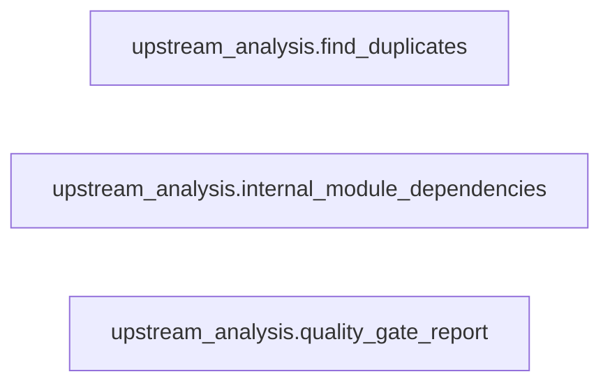

# Refactor Quality Report: `upstream_analysis`

Scope: `/workspace/refactor_cli/vendor/upstream_analysis`

## Move Candidates

- None

## Module Dependencies

| Module | Fan-in | Fan-out | Imports |
|---|---:|---:|---|
| `upstream_analysis.find_duplicates` | 0 | 0 | - |
| `upstream_analysis.internal_module_dependencies` | 0 | 0 | - |
| `upstream_analysis.quality_gate_report` | 0 | 0 | - |

## Cycles

- None

## Dependency Paths

- None

## Dependency Diagram

## Module Sources

- `upstream_analysis.find_duplicates`: [vendor/upstream_analysis/find_duplicates.py](vendor/upstream_analysis/find_duplicates.py#L1)
- `upstream_analysis.internal_module_dependencies`: [vendor/upstream_analysis/internal_module_dependencies.py](vendor/upstream_analysis/internal_module_dependencies.py#L1)
- `upstream_analysis.quality_gate_report`: [vendor/upstream_analysis/quality_gate_report.py](vendor/upstream_analysis/quality_gate_report.py#L1)

## Complexity Hotspots

- `vendor/upstream_analysis/quality_gate_report.py:846` `render_report`: 49
- `vendor/upstream_analysis/quality_gate_report.py:611` `decide_gate`: 44
- `vendor/upstream_analysis/internal_module_dependencies.py:630` `render_detailed_markdown_report`: 37
- `vendor/upstream_analysis/quality_gate_report.py:1320` `main`: 32
- `vendor/upstream_analysis/internal_module_dependencies.py:114` `collect_graph_metadata`: 20
- `vendor/upstream_analysis/internal_module_dependencies.py:166` `graph_from_ast`: 18
- `vendor/upstream_analysis/quality_gate_report.py:1245` `_ratchet_baseline_individual_metrics`: 16
- `vendor/upstream_analysis/find_duplicates.py:420` `main`: 14
- `vendor/upstream_analysis/quality_gate_report.py:369` `_interface_metrics`: 13
- `vendor/upstream_analysis/find_duplicates.py:353` `full_delta_report`: 11

## Duplicates

- `vendor/upstream_analysis/find_duplicates.py:202 _rel`, `vendor/upstream_analysis/quality_gate_report.py:157 _rel`

## Unused Functions

- `vendor/upstream_analysis/find_duplicates.py:54` `_strip_docstring`
- `vendor/upstream_analysis/find_duplicates.py:61` `_body_source`
- `vendor/upstream_analysis/find_duplicates.py:79` `_normalize_tokens`
- `vendor/upstream_analysis/find_duplicates.py:111` `_similarity`
- `vendor/upstream_analysis/find_duplicates.py:121` `collect_functions`
- `vendor/upstream_analysis/find_duplicates.py:142` `find_duplicates`
- `vendor/upstream_analysis/find_duplicates.py:161` `diff_bodies`
- `vendor/upstream_analysis/find_duplicates.py:180` `_iter_py_files`
- `vendor/upstream_analysis/find_duplicates.py:202` `_rel`
- `vendor/upstream_analysis/find_duplicates.py:209` `_normalized_ast_dump`
- `vendor/upstream_analysis/find_duplicates.py:222` `collect_ast_clones`
- `vendor/upstream_analysis/find_duplicates.py:272` `_load_snapshot`
- `vendor/upstream_analysis/find_duplicates.py:282` `_key`
- `vendor/upstream_analysis/find_duplicates.py:290` `_is_decorator_registered`
- `vendor/upstream_analysis/find_duplicates.py:300` `scan_high_param_functions`
- `vendor/upstream_analysis/find_duplicates.py:328` `scan_unused_functions`
- `vendor/upstream_analysis/find_duplicates.py:353` `full_delta_report`
- `vendor/upstream_analysis/internal_module_dependencies.py:22` `build_parser`
- `vendor/upstream_analysis/internal_module_dependencies.py:80` `iter_python_files`
- `vendor/upstream_analysis/internal_module_dependencies.py:86` `module_name_for_file`
- `vendor/upstream_analysis/internal_module_dependencies.py:93` `resolve_relative_module`
- `vendor/upstream_analysis/internal_module_dependencies.py:103` `nearest_known_module`
- `vendor/upstream_analysis/internal_module_dependencies.py:114` `collect_graph_metadata`
- `vendor/upstream_analysis/internal_module_dependencies.py:166` `graph_from_ast`
- `vendor/upstream_analysis/internal_module_dependencies.py:211` `graph_from_grimp`
- `vendor/upstream_analysis/internal_module_dependencies.py:230` `build_graph`
- `vendor/upstream_analysis/internal_module_dependencies.py:240` `invert_edges`
- `vendor/upstream_analysis/internal_module_dependencies.py:248` `strongly_connected_components`
- `vendor/upstream_analysis/internal_module_dependencies.py:288` `shortest_path`
- `vendor/upstream_analysis/internal_module_dependencies.py:317` `shortest_group_path`
- `vendor/upstream_analysis/internal_module_dependencies.py:338` `direct_group_edges`
- `vendor/upstream_analysis/internal_module_dependencies.py:357` `cycle_nodes_for_groups`
- `vendor/upstream_analysis/internal_module_dependencies.py:371` `cycle_group_path`
- `vendor/upstream_analysis/internal_module_dependencies.py:396` `representative_cycle`
- `vendor/upstream_analysis/internal_module_dependencies.py:414` `module_group`
- `vendor/upstream_analysis/internal_module_dependencies.py:421` `default_focus_groups`
- `vendor/upstream_analysis/internal_module_dependencies.py:430` `parse_focus_groups`
- `vendor/upstream_analysis/internal_module_dependencies.py:451` `group_edges`
- `vendor/upstream_analysis/internal_module_dependencies.py:462` `render_mermaid`
- `vendor/upstream_analysis/internal_module_dependencies.py:472` `markdown_link`
- `vendor/upstream_analysis/internal_module_dependencies.py:479` `module_text`
- `vendor/upstream_analysis/internal_module_dependencies.py:483` `module_ellipsis_link`
- `vendor/upstream_analysis/internal_module_dependencies.py:490` `edge_ellipsis_link`
- `vendor/upstream_analysis/internal_module_dependencies.py:498` `format_path_text`
- `vendor/upstream_analysis/internal_module_dependencies.py:502` `path_ellipsis_link`
- `vendor/upstream_analysis/internal_module_dependencies.py:512` `render_markdown_report`
- `vendor/upstream_analysis/internal_module_dependencies.py:597` `top_dependency_paths`
- `vendor/upstream_analysis/internal_module_dependencies.py:630` `render_detailed_markdown_report`
- `vendor/upstream_analysis/internal_module_dependencies.py:843` `sanitize_id`
- `vendor/upstream_analysis/internal_module_dependencies.py:847` `print_counter`
- `vendor/upstream_analysis/internal_module_dependencies.py:256` `visit`
- `vendor/upstream_analysis/quality_gate_report.py:39` `cc_rank`
- `vendor/upstream_analysis/quality_gate_report.py:53` `_rank_value`
- `vendor/upstream_analysis/quality_gate_report.py:135` `_iter_py_files`
- `vendor/upstream_analysis/quality_gate_report.py:157` `_rel`
- `vendor/upstream_analysis/quality_gate_report.py:164` `_percentile`
- `vendor/upstream_analysis/quality_gate_report.py:177` `_run_ruff_check`
- `vendor/upstream_analysis/quality_gate_report.py:205` `_normalized_ast_dump`
- `vendor/upstream_analysis/quality_gate_report.py:218` `_collect_function_hashes`
- `vendor/upstream_analysis/quality_gate_report.py:249` `_detect_duplicates`
- `vendor/upstream_analysis/quality_gate_report.py:274` `_lcom1`
- `vendor/upstream_analysis/quality_gate_report.py:302` `_cohesion_metrics`
- `vendor/upstream_analysis/quality_gate_report.py:354` `_is_decorator_registered`
- `vendor/upstream_analysis/quality_gate_report.py:369` `_interface_metrics`
- `vendor/upstream_analysis/quality_gate_report.py:416` `build_snapshot`
- `vendor/upstream_analysis/quality_gate_report.py:522` `_run_coverage_command`
- `vendor/upstream_analysis/quality_gate_report.py:539` `_coverage_age_minutes`
- `vendor/upstream_analysis/quality_gate_report.py:548` `_coverage_json_from_data_file`
- `vendor/upstream_analysis/quality_gate_report.py:572` `_load_coverage_snapshot`
- `vendor/upstream_analysis/quality_gate_report.py:611` `decide_gate`
- `vendor/upstream_analysis/quality_gate_report.py:804` `_snapshot_from_json`
- `vendor/upstream_analysis/quality_gate_report.py:846` `render_report`
- `vendor/upstream_analysis/quality_gate_report.py:1164` `parse_args`
- `vendor/upstream_analysis/quality_gate_report.py:1235` `_write_json`
- `vendor/upstream_analysis/quality_gate_report.py:1240` `_write_text`
- `vendor/upstream_analysis/quality_gate_report.py:1245` `_ratchet_baseline_individual_metrics`
- `vendor/upstream_analysis/quality_gate_report.py:1429` `_fmt_delta`
